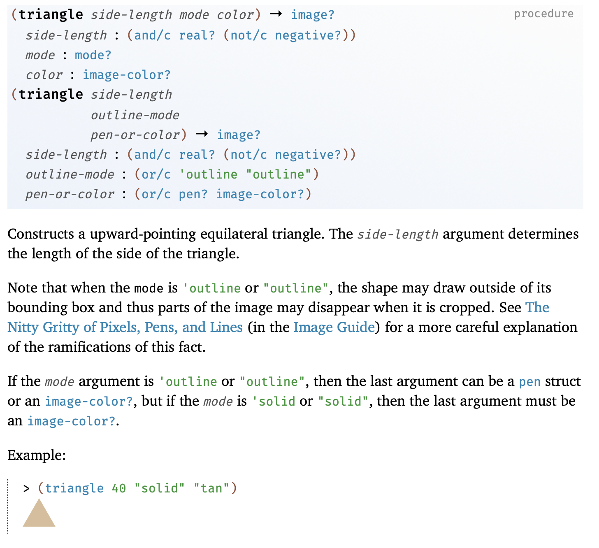
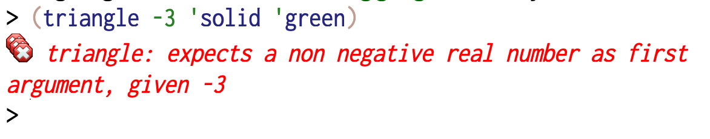
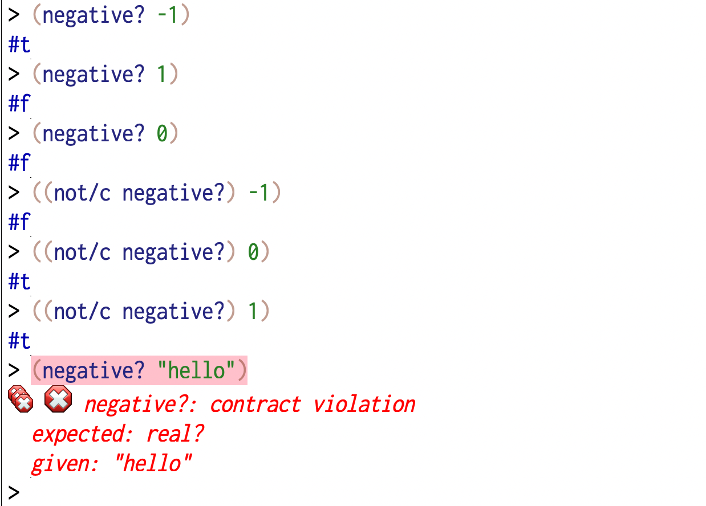
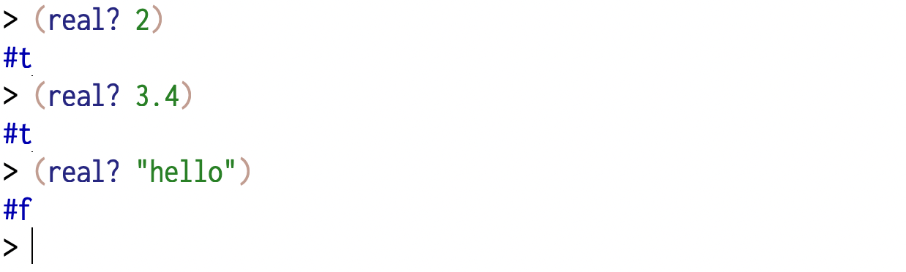
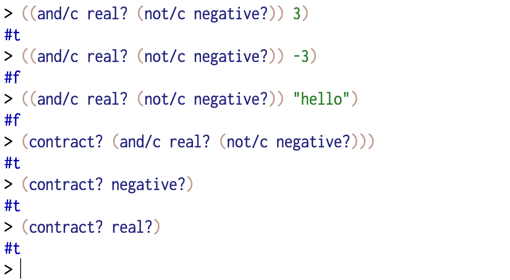

Assumptions and implications
============================

When writing procedure and function definitions to express a problem's
solution, the HtDP documentation requirements help us clarify the meaning of
each procedure/function definition before we even write it. Once we write it,
we might live under the assumption that what we've written is according to what
we documented.

**How do we know that what we wrote meets our intended meaning?**

This is the central question tackled by many different tools provided by
nearly every programming language or system. These tools fall into the following
kinds --

1. **Unit testing libraries** : These typically help check individual examples
   in a variety of contexts including extremities where failures are more likely
   and expected. In Racket, the package ``rackunit`` provides definitions that
   help write such "unit tests". We saw some of these in use in
   :ref:`knowing-it-works` where we checked some expectations of our parsing
   definitions.

2. **Property testing** : This refers to an approach of checking whether
   "properties" of a definition hold, by randomly generating inputs and testing
   the predicates associated with a property. There is some method to this
   "randomness" however, and once a failure occurs, property testing libraries
   also provide a facility known as "shrinking" where the failure case is reduced
   to a simple example that also exhibits the same kind of failure. These are
   therefore very useful **if** (and that's a big **if**) the programmer is adept
   at discovering such properties to be tested.

   Racket has packages quickcheck_ and rackcheck_ that provide definitions to
   help articulate properties of our definitions. After `the QuickCheck paper`_
   was published with an implementation first for Haskell, it was quickly ported
   as a library into many programming languages (See `wikipedia:QuickCheck
   <wikiqc_>`_).

3. **Contracts** : Contracts declared on identifiers help clarify the
   assumptions under which the identifiers can be meaningfully deployed and the
   implications they guarantee when meaningfully deployed. Operationally, they
   are checks inserted for the arguments and results of procedure definitions
   "provided" by modules, which ensure that all the necessary pre-conditions
   for a definition to apply (the assumptions) are met before the definition is
   used, and also that the definition indeed defines what it intends to define
   (the implication). These checks are run for each invocation of the
   definition, much like the way we inserted ``(when <cond> <error>)``
   expressions to check arguments.

   Racket provides definitions that make declaring such contracts_ an integral 
   part of the language. We've seen contracts in the documentation, though we
   haven't used them ourselves yet.

3. **Type systems** : Type systems offload the task of checking some kinds of
   pre-conditions and post-conditions of our definitions to a separate phase
   called the "type check" phase that is run only once when our program is
   compiled. While Racket attaches types to values, but not identifiers,
   type systems do their job by attaching types to identifiers and proving
   that declarations and inferences are consistent.

   Racket has a sister language called `typed racket`_ which lets you declare
   argument and result types of your definitions and get them checked beforehand
   instead of every time a definition is used, like with contracts. Once your
   program passes the type check, it is almost as though your program will be run
   without explicitly checking these while running, thereby making it faster
   than with contracts by doing less work overall.

   Pyret_ uses type declarations much like `typed racket`_ and you'll encounter
   this in your ICT course, so we won't deal with it in this course.

4. **Dependent type systems** : These are kind of "type systems on steroids".
   While many languages have type systems that live in a separate universe from
   the universe of values, dependent type systems bridge the two and let you
   express types that are dependent on other known values. This has been shown
   to be a very powerful tool capable of modelling and proving complex
   mathematical results through what is known as the "Curry-Howard
   correspondence" or the "types are propositions and programs are proofs"
   correspondence. We won't say much more about these in this course, except to
   say that if you're interested in a career in mathematics, then learning
   about these via languages like Lean_, Isabelle_ and Rocq_, and following and
   participating in projects like Mathlib_ would be of great interest and use
   to you. 

   In languages like Lean_, you can express a proof of correctness of your
   program before it even gets to run and when it passes the Lean compiler,
   your program has been proved to be correct according to the encoded
   specification. This means, the problem now shifts to ensuring that the
   specifications are encoded correctly!

We won't be looking at these in detail in this course. However we'll look at
"contracts" a bit closer as it is involved in the documentation you'll be
referencing. Also, when you're working with other languages, you should look
for the equivalent of contracts to understand the behaviour of definitions
you're borrowing from a library. Furthermore, type systems are closely related
to contracts in what they help clarify, though operationally they're different.

The **reason** we won't be looking at these in depth is that they all
constitute a set of tools that turn the mechanism of computing on to validating
what we're expressing in programming languages. They do not alter the "meaning"
of the programs we write [#tsmean]_ except to make clear to those making use of
definitions written by others as to the conditions under which those
definitions are usable and the guarantees they provide when used under those
valid conditions.

Contracts
---------

We saw in an earlier section when working with the "image" package from HtDP,
the documentation for ``triangle`` shown in :numref:`fig-triangle-docs`.

.. _fig-triangle-docs:

   The Racket documentation for ``triangle`` from the ``2htdp/image`` package. 

We're now going to dive a little into some of what this documentation tells us.
In particular, pay attention to the following declaration --

.. code:: racket

   side-length: (and/c real? (not/c negative?))

It is not hard to guess what this means. If we read ``negative?`` as a predicate
that tells us whether a particular number is negative or not, then we might
guess that ``(not/c negative?)`` expresses the idea of a "non-negative number".
So the entire expression seems to be saying something like "a real number
that is not negative". This tells us that when using the ``triangle`` definition,
the ``side-length`` argument can be either 0 or any real number greater than 0.

Indeed, if you ``(require 2htdp/image)`` and type the expression shown in
:numref:`fig-triangle-nn` into the interaction window, you'll see an error
message as shown.

.. _fig-triangle-nn:

   What happens when passing a negative number for the ``side-length``
   argument of ``triangle``.

Now how do we use "interrogation" to understand the ``(and/c real? (not/c negative?))``
expression?

.. _fig-negative:

   What ``negative?`` means -- it is just a "predicate" that tells you whether
   its argument is a negative number or not.

From :numref:`fig-negative`, we see that in the usage context where you're
giving a number as an argument, it tells you whether the number is a negative
number or not. You can also see from the last interaction in :numref:`fig-negative`
that it has a contract too -- that its argument **must** be a real number
and not something else.

.. _fig-real:

   ``real?`` is a predicate that checks whether the argument is a real number.

So in order to establish that a given value is a "non-negative real number",
we must combine the idea of a real number as captured by the predicate ``real?``,
as shown in :numref:`fig-real` with the constraint that it is ``(not/c negative?)``.
That is the job of the entire ``(and/c real? (not/c negative?))`` construct,
which you can see can itself be used as a predicate to check a value,
as shown in :numref:`fig-andc`.

.. _fig-andc:

   The ``(and/c ...)`` expression is a "contract" and contracts can be used as
   predicates to check whether a value meets some criterion.

As you might've guessed by now, the ``/c`` in the names ``and/c`` and ``not/c``
stand for "contract", to distinguish them from the regular boolean operators
``and`` and ``not`` which operate on boolean values and not on predicates.

You can read the introduction of `Racket contracts`_ to get an initial idea of
what constitutes a "contract". In particular, symbols, numbers and strings are
valid as contracts that recognize themselves. Procedures with arity 1 (meaning
procedure that accepts one argument) are treated as "predicates" and are
expected to produce ``#f`` to indicate that the argument does not meet the
contract. This means you can write your own contracts as ordinary procedures.
For example --

.. code:: racket

   (define (one-to-ten/c n)
      (and (integer? n) (>= n 1) (<= n 10)))

The above contract can also equivalently be given explicitly like this -

.. code:: racket
   
   (define one-to-ten/c (or/c 1 2 3 4 5 6 7 8 9 10))
   ; or alternatively as any of the following --
   ; (define one-to-ten/c (and/c integer? (>=/c 1) (<=/c 10)))
   ; (define one-to-ten/c (and/c integer? (between/c 1 10)))
   ; (define one-to-ten/c (integer-in 1 10))

Though these predicates we write can now be used to declare contracts, there is
more to making them a full fledged contract, because we also need to account
for what happens when contracts fail and how to produce error messages that the
programmer can understand.

.. note:: For our purpose, the main take away from contracts is that for the
   person reading your code, they help clarify the assumptions under which your
   definition(s) can be used and when used appropriately the implications they
   guarantee. It is an added bonus that contracts are live and will check and
   report on these assumptions and guarantees wherever the definitions are
   used. Contracts are therefore a limited but useful way in which your
   program can be interrogated without you explicitly interrogating it.
   If a contract does not fail, all is well. However, when it does, you get
   rich information about what exact assumption or implication was not met.

Writing definitions with contracts
----------------------------------

The most value provided by contracts is when you define your own words. You can
use contracts to communicate to anyone using your definitions what kinds of
arguments to supply and what kind of a value to expect when using the word as
an operator (if you're defining an abstraction, that is).

`Function contracts`_ describes how to define words along with contracts
for their arguments and implied values.

To make definitions with contracts, you use ``define/contract`` instead of
``define``. For example, in :ref:`The number guessing game`, we checked an
argument of our procedure like this --

.. code:: racket

   (define (play-number-guessing-game max-number)
      (when (not (and (integer? max-number) (> max-number 1)))
        (error "Expecting a positive integer > 1"))
      ...)

We can define this using contracts like this --

.. code:: racket

   (require racket/contracts)

   (define/contract (play-number-guessing-game max-number)
      (-> (and/c integer? (>/c 1)) void?)
      ...)

The ``(-> ...)`` term first mentions contracts for all the arguments in
sequence, and finally the contract met by the result. In this case, there is no
explicit result and so we declare that as meeting the ``void?`` contract.
The ``(>/c 1)`` expression is to be read something like "contractually
greater than 1" and the contract is equivalent to the predicate
``(lambda (n) (> n 1))``.

The reason ``->`` which looks like an "implication arrow" is used to declare
the contract for a function/procedure is because it is in essence saying "if
the assumptions for the arguments hold, then I grant that the implied result
will honour the result contract". It is, of course, to the body of the
definition to fully conform to the contract laid out. If it fails in some
circumstance, the contract mechanism will call it out with an appropriate error
message.

.. _Function contracts: https://docs.racket-lang.org/reference/function-contracts.html
.. _Racket contracts: https://docs.racket-lang.org/reference/contracts.html
.. _Lean: https://lean-lang.org
.. _Isabelle: https://isabelle.in.tum.de
.. _Rocq: https://rocq-prover.org
.. _Mathlib: https://mathlib.org
.. _Pyret: https://pyret.org
.. _typed racket: https://docs.racket-lang.org/ts-guide/
.. _contracts: https://docs.racket-lang.org/reference/contracts.html
.. _the QuickCheck paper: https://dl.acm.org/doi/10.1145/357766.351266
.. _wikiqc: https://en.wikipedia.org/wiki/QuickCheck
.. _quickcheck: https://docs.racket-lang.org/quickcheck/index.html#%28form._%28%28lib._quickcheck%2Fmain..rkt%29._with-small-test-count%29%29
.. _rackcheck: https://docs.racket-lang.org/rackcheck/index.html

.. [#tsmean] Actually in some cases they do, such as with type systems, but
   that's a subtlety we can gloss over given the introductory nature of this
   course.

