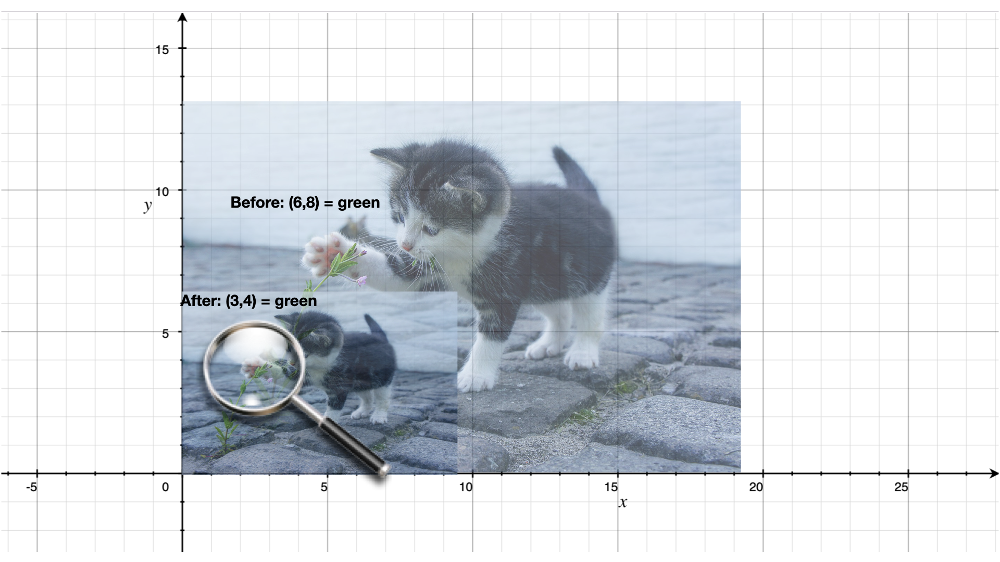

Modelling images
================

In this section, we work through the process of how to use programming to try
and understand a domain better, by working our way ground up. It requires
some fluency with the "interrogation" approach we worked through in earlier
sections and also with the notion of "procedures as abstractions" which was
dealt with when we worked on parsing strings. The parsing topic itself
was a soft intro to this approach, but here we'll go a little deeper.

The content of this chapter is based on an old research paper published by
Conal Elliot called Pan_ which described a way to think about constructing
images through programs.

Images
------

We use the word "image" as distinct from a "picture" for the purpose of this
section, though there is not a very significant difference between the two.
We include the possibility of photographs being an "image" where as we take
a picture as mostly something that is "drawn" using some mechanism. Again,
this is not a distinction worth emphasizing, but it is just to clarify the
language used here.

Let's say we have an image in computer memory -- ``apple``. We presume it
represents some visual thing that looks like an apple. Either a drawing of
an apple or a photograph of one.

The basic thing we can expect to do with an image is to show it. We'll call
this ``render-image``, since "display", "show" and such have other meanings
given to them by Racket. So ``(render-image apple)`` should give us something
we can see. We might similarly image another word ``render-image-to-file``
which will produce a PNG or JPG file containing the depiction that we can view
using any external tool -- ``(render-image-to-png-file apple "apple.png")``.

We might ask many questions of such a rendered image -- What is its width and
height? Which portion (rectangle) of the image has been rendered?. It would
seem that these should be intrinsic properties of an image, but we can also
think of a fractal "Mandelbrot set" as an image that has a conceptually
infinite amount of detail in it, so it would be necessary to make the
dimensions and portion specific in order to get a concrete rendering of it.

So ideally, our rendering procedures will be something like --

.. code:: racket

   (render-image apple <width> <height> <x0> <y0> <x1> <y1>)
   (render-image-to-file "apple.png" apple <width> <height> <x0> <y0> <x1> <y1>)

where the :math:`(x_0,y_0,x_1,y_1)` define a rectangle by giving the top-left
coordinate :math:`(x_0,y_0)` and the bottom right coordinate :math:`(x_1,y_1)`.

.. _Pan: http://conal.net/Pan/

Need for a representation
-------------------------

When we're looking at modelling an idea like an "image" that we don't yet fully
understand [#imund]_ to actually start doing things with images, we need to 
pick a "representation" that we can use in our program. The term "representation"
refers to determining which of available mechanisms can be used to model the
thing we're looking at so as to enable us to work with it in ways that we expect
to.

Picking a representation therefore implies that we know the ways in which we want
to work with it. Note that there are dimensions of representations that we may not
be concerned with initially as we work towards understanding a domain, but might
wish to get to later. These include efficiency of operations, interoperability 
with some other software, optimal memory usage and so on. Before we get to that,
we need to understand images by first clarifying what we want to do with them.

Doing things with images
------------------------

You're given an image bound to the identifier ``apple``. What can you do with it?

- Maybe you want to overlay two apple images to make a "bunch of apples". Let's
  write it as ``(overlay apple apple)``. This phrase isn't precise just yet,
  because in our minds as we think of overlaying an apple image on another, we
  might think of an apple "near" another apple and not exactly on top of it,
  which would hide it. But "how close?" then becomes another question we need
  to answer through our expression. Since a relative position shift can be
  given by a pair of numbers :math:`(\mathrm{d}x,\mathrm{d}y)`, maybe we can
  write our expression as ``(overlay dx dy apple apple)``. This still isn't
  very clear as we don't quite know which of the two apples the
  :math:`(\mathrm{d}x,\mathrm{d}y)` applies to. We can pick a convention, which
  would be one solution. However we can also take this opportunity to note that
  "an image shifted by :math:`(\mathrm{d}x,\mathrm{d}y)` is also an image" to
  simplify the ``overlay`` concept. Now, maybe we can write our intention as
  ``(overlay apple (shift dx dy apple))``. This pattern is now accessible to us
  for other purposes too -- ex: ``(overlay apple (shift dx dy orange))``,
  ``(overlay apple (overlay (shift dx1 dy1 orange) (shift dx2 dy2 pear)))``,
  and so on. 

  .. admonition:: **Insight**

      When we define a word whose argument types and result types are the same
      ("image" in this case), we immediately gain a very large number of ways
      to combine the values. If the operation only has one argument, then the
      only thing we can do is to apply the operation multiple times. However if
      we have more than one such operation, or more than one argument of the
      same type, the possibilities explode even more. We see this with
      ``shift`` and ``overlay``.

- Maybe we want to make an image bigger or smaller -- i.e. "scale" it. We can
  express this idea using :math:`(s_x,s_y)` scaling factors like this ``(scale
  sx sy apple)``. Now we can put apples of various sizes near each other in a
  cluster by combining ``overlay``, ``shift`` and ``scale``.
  
  .. admonition:: **Task**

      Write some expressions of a "fruit scene" using the given images
      bound to identifiers ``apple``, ``banana`` and ``orange``, using
      the operators ``overlay``, ``shift`` and ``scale``.

Understanding what we've asked for
----------------------------------

Now, we still can't make any images because we don't know what an image is yet?
i.e. We haven't selected a representation for it yet and therefore we cannot
construct a single image. However, we're close and we need to pay some attention
to what we've asked for in the section above.

The ``shift`` and ``scale`` words imply some kind of an "X/Y axis coordinate system"
for our images. ``(shift 2 1 apple)`` might be expected to shift the apple
twice as much to the right as ``(shift 1 1 apple)``. Depending on how we choose
our y axis, say we pick it to be pointing vertically upwards, ``(shift 1 2 apple)``
would shift it twice as much upwards as ``(shift 1 1 apple)``.

   Scaling a picture of a cat by half using ``(scale 0.5 0.5 cat)``.

But what does "shifting" or "scaling" mean? With reference to the picture above,
we might say "whatever is happening at a given coordinate :math:`(x,y)` is now
happening at a different coordinate :math:`(x+\mathrm{d}x,y+\mathrm{d}y)` for an image shifted
by :math:`(\mathrm{d}x, \mathrm{d}y)` and similarly for a scaled image, whatever was "happening"
at :math:`(x,y)` is now "happening" at :math:`(x \times s_x, y \times s_y)`. 

The key idea here is that something is "happening" at a given coordinate :math:`(x,y)`.
For visual image, the only thing we can tell that's special about a given point
is the colour at the given point. So, we can now think of an "image" as a
mapping from a given coordinate :math:`(x,y)` to a colour which is often
graded in computer systems as a mixture of three "primary" colours red, green
and blue -- :math:`(red,green,blue)`.

Another word for "mapping" is "function" and programming languages let you
describe mappings by giving general ways by which to compute the target value
given the source value of the mapping, instead of, say, listing every possible
combination and checking the input against such a table.

.. code:: racket

   (struct colour (red green blue))

   (define (red-circle radius)
      (define (colour x y)
         (if (< (+ (* x x) (* y y)) (* radius radius))
            (colour 1.0 0.0 0.0)
            (colour 0.0 0.0 0.0)))
      colour)

Or using the "lambda" approach,

.. code:: racket

   (define (red-circle radius)
      (lambda (x y)
         (if (< (+ (* x x) (* y y)) (* radius radius))
            (colour 1.0 0.0 0.0)
            (colour 0.0 0.0 0.0))))

.. collapse:: **Alternative ways of writing ``red-circle``**

   There are many ways to write the same ``red-circle`` definition. You should
   always choose the way that *for you* expresses the idea in the clearest
   manner. Concerns like optimization of calculations come only after clarity.

   .. code:: racket
      
      ; While the same, it doesn't let us think of "red-circle"
      ; in the abstract and forces us to consider how it deals with
      ; coordinates right in its definitional form.
      (define ((red-circle radius) x y)
         (if (< (+ (* x x) (* y y)) (* radius radius))
            (colour 1.0 0.0 0.0)
            (colour 0.0 0.0 0.0)))

   .. code:: racket

      ; This one uses the fact that the two paths don't choose
      ; different values for green and blue components of the colours
      ; and uses the (if..) to only pick the red value. While this is
      ; correct, it doesn't generalize well and we'll need to change
      ; the *form* of the definition if we decide for some reason that
      ; the inside of the circle should be orange and outside should be
      ; teal. However, this form is useful if we want to vary the colour
      ; for different values of the distance from the origin (0,0).
      (define (red-circle radius)
         (lambda (x y)
            (colour (if (< (+ (* x x) (* y y)) (* radius radius)) 1.0 0.0)
                    0.0
                    0.0)))

   So you see that in writing programs, we don't just care about being correct
   about what the program means, we also care about *how* the meaning is
   expressed -- i.e. the **form** -- because we can derive new meanings by
   manipulating the form.
   

We now have a "representation" for an image as a map from :math:`(x,y)`
coordinates to an RGB ``colour``. This means the other words we wanted,
such as ``overlay``, ``shift`` and ``scale`` will have to work with
this same representation.

Expressing ``shift``
--------------------

With ``(shift dx dy img)``, we described it as "whatever used to happen
at :math:`(x,y)`` in the ``img`` now happens at :math:`(x+\mathrm{d}x, y+\mathrm{d}y)`.
We can capture this relationship in a definition like given below. You
should try to define it yourself first before revealing the solution.

.. collapse:: **Defining shift**

   .. code:: racket

      (define (shift dx dy img)
         (lambda (x y)
            (img (- x dx) (- y dy))))

Expressing ``scale``
--------------------

This is very similar to ``shift`` and if you've done that, you should
definitely give this definition a go. Remember that ``(scale sx sy img)`` is an
image where "whatever was happening at :math:`(x,y)` in the image now happens
at :math:`(x \times s_x, y \times s_y)`".

.. collapse:: **Defining scale**

   .. code:: racket

      (define (scale sx sy img)
         (lambda (x y)
            (img (/ x sx) (/ y sy))))

Expressing ``overlay``
----------------------

We need a precise notion of what ``(overlay apple banana)`` means. One possible meaning
is that the ``banana`` should appear right on top of the ``apple`` wherever its colours
are valid and the apple should show through wherever the banana gives no colours.

In our representation ``(colour r g b)``, which is the only value produced by
an image that maps :math:`(x,y)` to colour, we do not have a way to tell whether a
particular colour returned is part of the banana or not. 

A common way to include this information in a colour is the ARGB representation
where we use a fourth number -- the so called "alpha channel" -- which takes
values in the range :math:`[0.0,1.0]` -- and expresses how "opaque" the colour
is. So we now change our colour definition to include such an "alpha channel"
in order for ``overlay`` to be possible. Given such an "alpha" value, we can
use simple linear colour mixing to determine the resultant colour at each point
in the final image. For the moment, let's consider "alpha" to be *either*
:math:`0.0` *or* :math:`1.0` for ease of thinking about colour mixing without
knowing too much colour theory.

.. code:: racket

   (struct colour (alpha red green blue))

   (define (overlay behind-img front-img)
      (lambda (x y)
         (let ([c1 (behind-img x y)]
               [c2 (front-img x y)])
            (if (> (colour-alpha c2) 0.5) c2 c1))))

Exercises: Other ways to combine images
---------------------------------------

Now that you have ``shift``, ``scale`` and ``overlay`` in your vocabulary,
define the following shapes and ways to combine images. (Assume ARGB colour
for these).

1. Define a ``(box width height colour)`` which should give you a box whose
   bottom-left corner is at :math:`(0,0)` and it has a given width and height
   and its interior is of the given colour.

   Question: What colour should its exterior be?

2. Define a ``(disc radius colour)`` which should be a circle of the given radius
   filled with the given colour inside. Again, what should be the colour outside?

3. Define a ``(rotate angle-degrees img)`` which would be a rotated version of
   the given image. So ``(rotate 90.0 (box 1.0 10.0 black))`` should
   effectively give you a box with width :math:`10.0` and height :math:`1.0`
   whose right bottom corner is at the origin. You'll need some high school
   trigonometry to work this out.

4. Using all the elements and operator words you've defined so far, make a
   picture of a "cricket pitch".
         

.. [#imund] Just us, and at this moment, obviously there are other people who
   understand it.  
