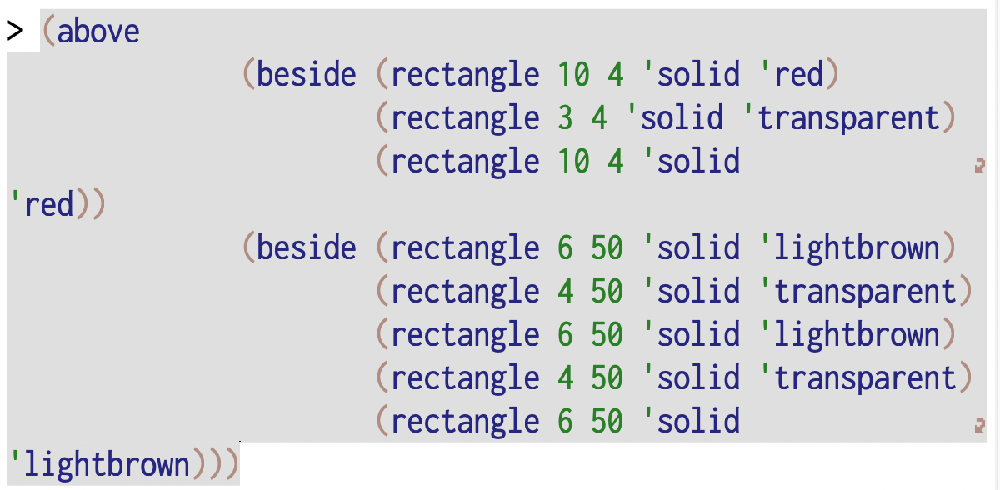
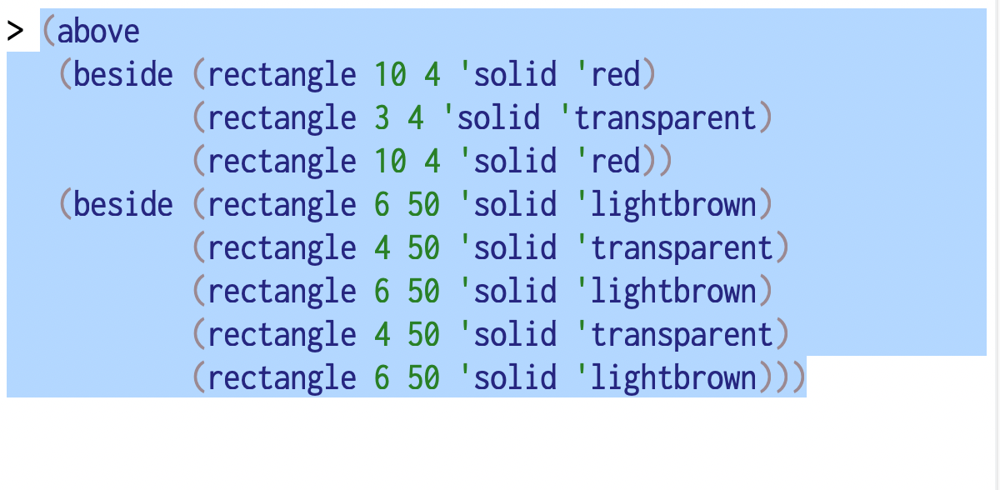
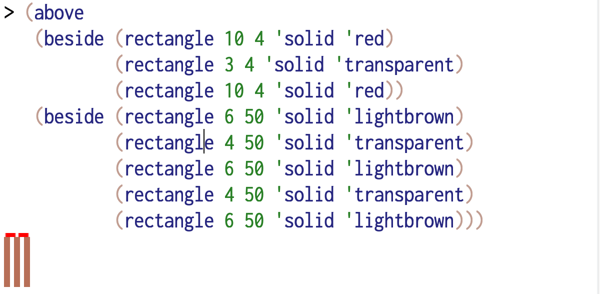
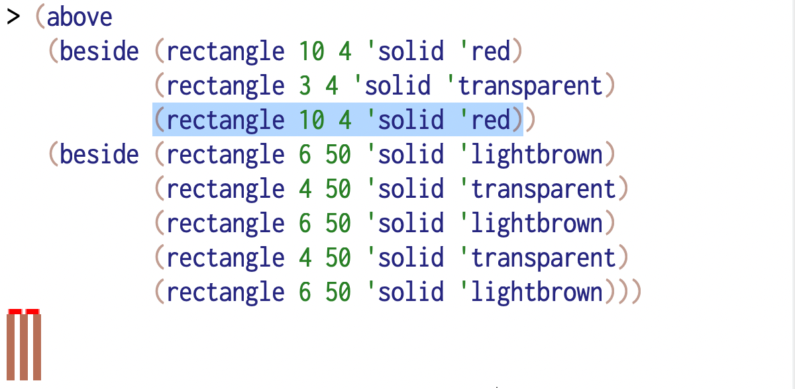
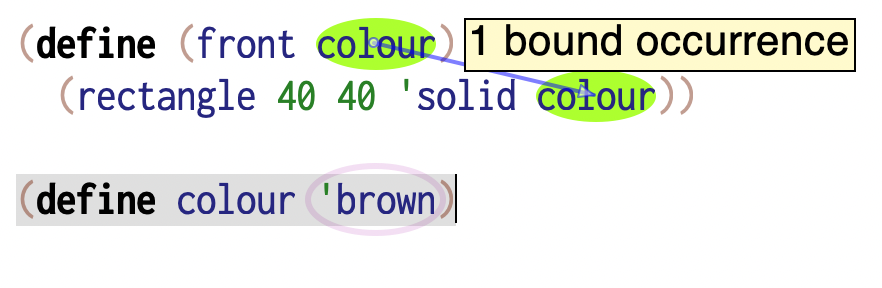
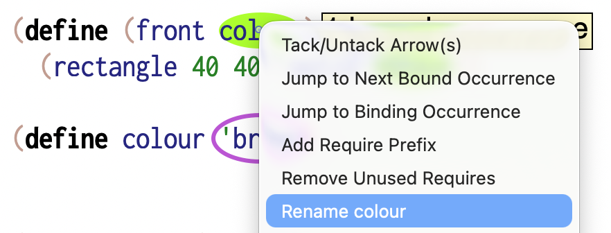

The editor
==========

The text editor plays an important role in the practice of computing, a role
that often goes unrecognized in what goes for "computer science". When looking
at programming as a literacy, the tools of the programmer also gain an
importance, much like a type writer or a specific word processor will have a
significance for a creative writer. We'll look at DrRacket's editor in the
definitions and interactions windows a little so you can gain some familiarity
with them.

.. note:: There are also general purpose editors such as Vim, Emacs and (more
   recently) Zed, which support multiple programming languages. For the purpose
   of this course, we recommend you stick with DrRacket to avoid being distracted
   by editor idiosyncrasies.

Conventions
-----------

- We usually notate pressing the "Ctrl" key along with a letter, say, "x" as
  ``C-x``. Here, we'll also use "C" to refer to the "Command" key on a Mac.
- Similarly, we notate pressing the "Alt" key ("Option" on a Mac) with a letter "x"
  as ``M-x`` where "M" stands for "Meta".
- The shift key with a letter "x" will be notated as "S-x". 
- We'll write special keys like arrows, like ``<left>``, ``<up-arrow>`` and such.

These may be combined. So ``M-C-x`` means "press the Alt key, the Ctrl key and then
type the key ``x``".

The usual suspects
------------------

Editor movements you're familiar with in other common editors also work in 
DrRacket. These include - 

- ``C-x`` is "Cut selected text"
- ``C-c`` is "Copy selected text"
- ``C-v`` is "Paste selected text"
- ``<del>`` or ``<backspace>`` will delete the character immediately to the
  left of the cursor, or the current selection if there is one.

Term highlighting and selection
-------------------------------

Compound terms of the form ``(<term> <term> ...)`` can be "nested" within 
each other. So it is useful to know where a particular term ends if you're
at a starting position, or vice versa.

When your cursor position is just before the start of a compound term or just
after the end of such a term, DrRacket will highlight the whole term. When you
see the term being highlighted, you can then select it with a single key
stroke. This highlighting is a very important clue for you since all valuable
operations when working with programs work on whole terms, compound or simple.

- ``M-S-<rightarrow>`` will select the highlighted term to the right of
  the cursor, or the non-compound term immediately to its right. 

- Similarly ``M-S-<leftarrow>`` will operate on the highlighted term to the
  left of the cursor, or the non-compound term immediately to its left.

Non-compound terms like literals and identifiers will not be shown as
highlighted.

This highlighting and selection works the same way in the definitions window
as well as in the interactions window.

Sometimes you've broken sub-terms onto separate lines but not aligned them up
in a legible manner. To do this, just select the term in the definitions window
and press the ``<tab>`` key. In fact, you can select the entire contents of the
window using ``C-a`` and press the ``<tab>`` key to align everything in the
window. What this won't do for you is to break things up into lines, as how
that is done is generally considered a "matter of taste".

Evaluating expressions
----------------------

Getting DrRacket to tell you what an expression refers to is called
"evaluation", for "finding out the value of". Remember that "value" is what we
used to refer to a representation of a thing stored in computer memory. We've
also said things like "identifiers refer to values".

You do this by typing or pasting the term whose value you want to know, at
the interaction window's "prompt" which looks like :hl`>`, and pressing the
``<enter>`` key with your cursor at the end of the term. If your cursor happens
to be somewhere in the middle of a term, then pressing ``<enter>`` will
break the line at that point and create a multi-line term. 

If you want to evaluate the whole term in the interaction window prompt when
your cursor is in the middle of the term somewhere other than at the end, you
can just press ``M-<enter>``. The figures below show the various editing options.

.. _fig-sb-unformatted-paste:

   When you copy a multi-line compound term from the definitions window
   and paste it into the interactions window, it will appear literally as is
   at first.

.. _fig-sb-select-and-tab:

   When you're in the situation of :numref:`fig-sb-unformatted-paste`, you can
   select the whole term using ``M-S-<right>`` and press ``<tab>`` to properly
   align the sub-terms as shown here.

.. _fig-sb-eval-from-middle:

   In the interactions window, when you have an active expression at the prompt
   and you want to evaluate it when your cursor is not at the end of the expression,
   you can press ``M-<enter>``.

.. _fig-sb-selected-subexpr:

   If you've already evaluated an expression in the interaction window and wish
   to examine one of its sub-terms (a.k.a. sub-expressions), you can select the
   sub-term and press ``M-<enter>`` to bring it into the active prompt.
   Pressing ``<enter>`` again will evaluate just that term. This is a short cut
   for copying that selection and pasting it into the active prompt using ``C-c
   C-v``.

To recall the earlier evaluated term in the interaction window, press the
``<Esc>`` key followed by ``p``. We will write this as ``<Esc> p``, which means
"press and release ``<Esc>`` and then press and release ``p``". [#hyphen]_ You
can step back into the history by pressing ``<Esc> p`` as many times as you
need. Analogously, pressing ``<Esc> n`` will get you the "next" expression in
the evaluation sequence. Using these two, therefore, you can "walk" up and down
the history of expressions you've evaluated at the interaction prompt.

Getting help
------------

DrRacket's definitions window facilities provide access to documentation pertaining
to identifiers provided by packages. With your edit cursor positioned on such an
identifier (say ``define``), point your mouse at the top right corner of the
definitions window to have a panel open up with information that *reminds* you
how to use ``define``. To read its full documentation, you can then click the
`read more ... <def_>`_ link within the pane.

.. _fig-triangle-popup:

.. figure:: images/triangle-docs1.png
   :align: center

   The usage and contracts are displayed in the reminder in the popup panel.
   Here you see the panel for ``2htdp/image`` package's ``triangle``.

.. figure:: images/triangle-docs2.png
   :align: center

   When you click the `read more ... <tri_>`_ link in the
   :numref:`fig-triangle-popup`, you're taken to the page contents shown here.
   In the documentation, you'll not only find the argument and result
   "contracts" that the usage must meet / can expect. 

.. _tri: https://docs.racket-lang.org/teachpack/2htdpimage.html#%28def._%28%28lib._2htdp%2Fimage..rkt%29._triangle%29%29
.. _def: https://docs.racket-lang.org/reference/define.html#%28form._%28%28lib._racket%2Fprivate%2Fbase..rkt%29._define%29%29

Renaming
--------

You've seen DrRacket draw arrows from the definition context of an identifier
to its use context. This means it keeps track of each group of identifiers
which share a definition context. Even when you use the same name in a different
context, Racket treats them as different (and so would any programming language).

Therefore if you want to give a different and more meaningful name for an identifier
in a given context, you'd want to change all of its occurrences only in that
context, without changing it in any other context where the same word might've been
used to mean something else. 

To do such a context aware renaming, right-click on the identifier and select "Rename".

   The first occurrence of ``colour`` is "local" to the context introduced
   by the ``front`` abstraction. [#oval]_ The identifiers that are its
   "arguments" take meaning only within the expression contained in the
   ``(define ...)`` term.

   The right-click menu (a.k.a. context menu) on an identifier presents an item
   called "Rename" that lets you rename the identifier in the context of the
   identifier at the clicked position. This isn't a plain textual "find and
   replace" operation as it is context aware and helps you clarify your program
   by choosing good names.

Closing remarks
---------------

As noted at the start, the editor plays a role in gaining a visceral feel for
programs you work on. From a situated cognition perspective, one might say the
editor participates in the construction of your mental models of a program as
you go further in your journey, and the tool becomes an extension of your
thinking over time. It is for this reason that programmers gravitate towards
and stick with their "favourite" editors over their careers. 

We use DrRacket in this course for its pedagogical design value. Few editors
are deeply integrated with the semantics of programming languages, and they
rely on various "plugins" to support such features. Some good ones that have
stood the test of time are Emacs_, Vim_ (Neovim_). A relatively recent entrant
that has gained wide adoption due to its flexibility and extension ecosystem is
`Visual Studio Code`_. Of these, Emacs_ is legendary for its extensive support
for not just editing Common Lisp programs, but also directly working with the
live environments deployed programs. This was possible because Emacs_ is itself
programmable in `Emacs LiSP`_. 

So take every opportunity to get familiar with the editor as you progress
through this course.

.. _Emacs LiSP: https://en.wikipedia.org/wiki/Emacs_Lisp
.. _Emacs: https://www.gnu.org/software/emacs/
.. _Vim: https://www.vim.org/
.. _Neovim: https://neovim.io/
.. _Visual Studio Code: https://code.visualstudio.com

.. [#hyphen] If we had written it as ``<Esc>-p`` we would've meant "press and
   hold ``<Esc>``, then press ``p`` and release both of them".

.. [#oval] DrRacket draws an oval around the ``'brown`` to tell you that the
   value is not being used because the second ``colour`` is not referenced
   anywhere.

