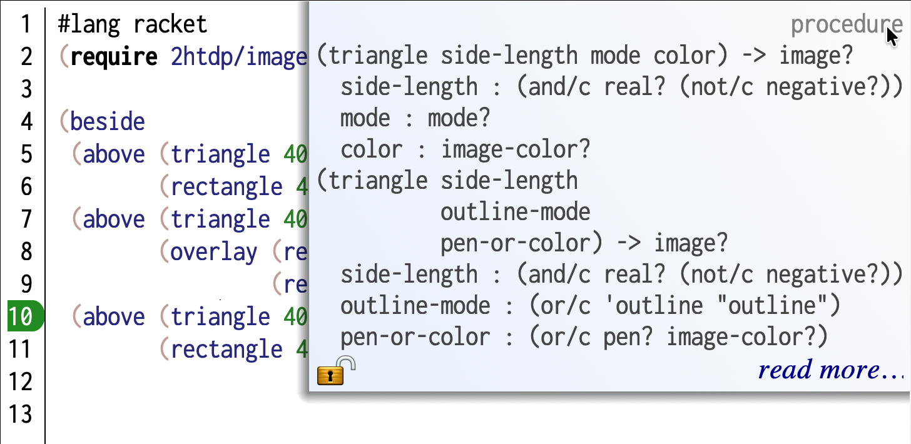
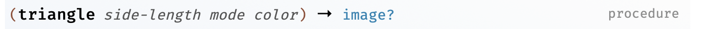
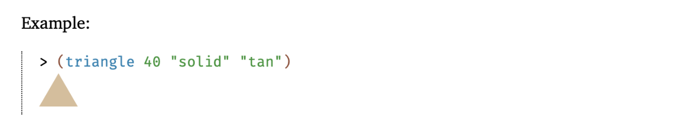

Interrogating programs
======================

Consider the following program that builds an image --

.. code:: scheme

   #lang racket
   (require 2htdp/image)

   (beside
      (above (triangle 40 'solid 'red)
             (rectangle 40 40 'solid 'brown))
      (above (triangle 40 'solid 'red)
             (overlay (rectangle 40 40 'outline 'black)
                      (rectangle 40 40 'solid 'green)))
      (above (triangle 40 'solid 'red)
             (rectangle 40 40 'solid 'brown)))

How do we go about understanding what this program does if we know only the
basic notation of Racket to help us read it? Below is a possible approach for
this particular program. The principles used to interrogate this program are
general though and you'll gradually build fluency with them.

Run the program
---------------

First, we see that the only thing the program does is to construct an image. We
know this because we know the words we're reading make images either from
scratch or by combining images they apply to.

So we can just hit "Run" and see what happens. We get what looks like a row of
three houses (well, imagine they are). This step is part of understanding the
result of a program. We still haven't figured out how the program produces it.

Running the program has many uses. If there are basic errors in the program
such as the syntax used, Racket will flag them when you hit "Run". If the
program makes use of identifiers that aren't in the scope, Racket will flag
those for you. [#addpkg]_ You can then decide what you wish to do with the
program -- you can try to fix it or send it back to its creator and report the
problem.

Some kinds of programs only provide definitions and don't actually compute any
values. Once you're done with this section, you'll have an idea of how to
understand such programs as well.

Code formatting
---------------

Programs are written not only to instruct computers, but also to communicate
"how to" knowledge to other human readers.

   "Programs must be written for people to read and only incidentally for
   machines to execute".

   -- Gerald Sussman, in "The Structure and Interpretation of Computer Programs"

The way the arguments to the ``beside`` word are laid out is something
to pay attention to. Each sub-expression appears aligned on its own
-- i.e. the ``(above`` are all visibly distinct. Compare that with
the below way of writing the same program --

.. code:: scheme

   (beside (above (triangle 40 'solid 'red) (rectangle
   40 40 'solid 'brown)) (above (triangle 40 'solid 'red) (overlay
   (rectangle 40 40 'outline 'black) (rectangle 40 40 'solid
   'green))) (above (triangle 40 'solid 'red) (rectangle 40
   40 'solid 'brown)))

To Racket, this reads the same and it means exactly the same as the program
above, and will therefore produce exactly the same image. Racket doesn't care
how many or what kind of space you use to separate the words you give it. But
it is clear that if we write it this way, the relationships between the parts
are obfuscated compared to the original presentation above.

.. caution:: 

   Different programming languages show different tolerances to such re-flowing
   of the code. With python, the "white space" matters and often confuses
   novices. Haskell also has white space sensitive syntax, though there are
   means to get around it. But other languages like C/C++, Java and Julia are
   far less white space sensitive.

Racket helps you communicate to your reader how you want your program to be read.
With the above code copy-pasted into DrRacket's editor, place your cursor to
the left of the first ``(above`` and press <enter>. You'll see that it appears
automatically indented on the next line. For the ``above`` expression which
composes two pictures, we can permit one of them to be on the same line without
loss of clarity. So now place the cursor to the left of ``(rectangle`` and
press <enter>. You'll see that Racket will align it with the opening
parenthesis of the preceding ``(triangle``. By proceeding in this manner, you
can format the text in a manner you think aligns with the way you - the author
- read the expression and expect your readers to do the same.

.. admonition:: **Expectation**

   You're expected to present your code to humans, well formatted,
   as any literate programmer would do.

Challenges reading code
-----------------------

To read text in any language and understand what is being said, you need to
know the script, how words are constructed, vocabulary (i.e. words and what
they mean), phrase and sentence structure (i.e. the grammar). 

Programs are not very different from that. 

+ **Words**: What identifiers does the program use?
+ **Context**: Where does the meaning of a particular identifier come from?
  Local contexts are also called "scope".
+ **Expression**: What is the extent of an expression? i.e. where does a complete
  expression that an identifier participates in begin and end.

Unknown words
-------------

If you don't know the meaning of a word/identifier used in the Racket code, you
can place the cursor on the word in DrRacket. You'll see a documentation arrow
at the top right corner of the editor window. If you then move your mouse to
that arrow, you'll see it open up and provide some information about how to use
that word. This is a brief that assumes you only need to be **reminded** of how
to use it. If you truly don't know, you can click the "Read more" link which
will take you to the documentation of that identifier.

   
   An example of using the quick reference to remind yourself of how the
   ``triangle`` word provided by the ``2htdp/image`` package is to be used.
   Notice the "read more..." link that will take you to the full documentation.

The full documentation for ``triangle`` is shown below. It consists of two
parts -- first comes a syntactic presentation of how the word is to be used.
This should give you an idea of the pattern to expect in the code wherever
you're seeing the ``triangle`` word (in the ``2htdp/image`` package context).
The second is a textual description of what it means. This usually also includes
a description of the "arguments" a.k.a. "parameters" of the expression that
the operator word is part of, whose meaning you're really interested in.

.. figure:: images/triangle-docs2.png
   :align: center

   The full documentation of the ``triangle`` word.

In the first part of the documentation, for now, you'll need to pay attention
to just the expression form with the named arguments as shown in triangle-docline_.

.. _triangle-docline:

   First documentation cue about how to use ``triangle``.

This line says that the bold operator word (**``triangle``**) is a "procedure".
This means it needs to participate in an expression with some additional given
information (its "arguments") in order to mean something in your program.

The line also points to ``triangle`` needing three such arguments -- the
``side-length``, the ``mode`` and ``color``. If you're just trying to remind
yourself of the operator, these argument names are usually sufficient and you
can move on from here. If you can't tell what *side-length* means, for
instance, you can read the body text to understand. More often, you can use
your understanding of what a "triangle" is to guess what *side-length* might
mean, and cross check your understanding in the interaction window.

The line also says that the whole expression is an "image" (the "→ image?" part
of the line). The reason there is an "?" at the end of "→ image?" is that the
``image?`` word itself is a procedure that answers ``#t`` when given an image and
``#f`` for any other kind of value. In a way, what the "→ image?" part is telling you
is that ``(image? (triangle <side-length> <mode> <color>))`` (for specific values
of the arguments) will always give you ``#t``.

We'll skip the remainder of the top box for now and skip to the body text.
Usually the body text will also include one or more examples of using the
procedure word/identifier. It will often also have hyperlinks to other parts
of the documentation that give more detail.

.. warning:: Read documentation with a question in mind

   If you force yourself to read all the documentation pertaining to a single
   operator word like ``triangle`` and follow through all the hyperlinks,
   you might end up reading about all of Racket and the 2htdp/image package!
   It is therefore very important to read with a question in your mind and 
   seek the answer to that question. Once you get an answer, another question
   might form in your mind which might require reading further. As long as
   knowing the answer to that question contributes more to your understanding
   of the previous answer, seeking out this follow up question is ok. But
   don't in general "go down the rabbit hole", but **read with intention**.

A very useful part of the body of the documentation is the "examples" section.
Just reading the code in the examples section often gives you an idea about how
the word is to be used.

   The example presented in the documentation for ``triangle`` in the
   ``2htdp/image`` package.

Putting all of this together, we can now understand the expression
``(triangle 40 'solid 'red)`` to mean "an upright solid red triangle
of side length 40 units".

Sub-expressions
---------------

Even before we jump into the documentation for ``triangle``, we can
find out what the expression means using the interaction window.
Since all the supplied arguments to the triangle are concrete values
and not identifiers that further need to be determined, we can simply
copy-paste the ``(triangle 40 'solid 'red)`` expression and paste
it into the interaction window (and press <enter>, which we'll stop
saying from now on). 

.. hint:: Copy-pasting expressions in DrRacket

   DrRacket makes it easy for you to work with expressions. If you position the
   cursor to the left of the opening parenthesis of ``(triangle ...)``, you can
   see that DrRacket highlights the expression already. To copy-paste the
   ``(triangle 40 'solid 'red)`` expression, position the cursor to the left of
   the opening parenthesis, then press alt-shift-rightarrow to select the whole
   expression. Then the usual copy/paste commands work as usual. If you're
   closer to the closing parenthesis, you can use alt-shift-leftarrow once you
   place the cursor to the right of the closing parenthesis to select the
   expression. 

   These cursor movements are very useful when rewriting expressions to
   understand them.

You'll see a red upright triangle show up there. You might have questions about
what the ``40`` means, in which case you can type out ``(triangle 80 'solid
'red)`` and you'll see a bigger triangle and can therefore guess that the
number has to do with the size of the triangle. You might also try out
``(triangle 40 'solid 'green)`` and see that various colour names are possible
for the third argument.

You can go through the same process for ``(rectangle 40 40 'solid 'brown)``
as well since all its arguments are also known and you might only need to
lookup the documentation for ``rectangle`` if you want to do that.

.. admonition:: **Task**

   Go through the above process for ``rectangle`` and the expression to
   familiarize yourself with this process.

Giving meaning
--------------

The interesting thing about our program is that it is made up of expressions
all the way. Let's look at the ``(above ...)`` expression first.

.. code:: scheme

   (above (triangle 40 'solid 'red)
          (rectangle 40 40 'solid 'brown))

Now that we know what the ``(triangle ...)`` and ``(rectangle ...)``
expressions mean, we can "read" the ``(above ...)`` expression as
``(above <a-red-triangle> <a-brown-rectangle>)``. Given the
word has been well chosen in this case, we might guess this whole
expression means the picture "a red triangle above a brown rectangle".

You have a couple of paths in front of you now. You can either go to the
documentation of ``above`` to confirm your guess, or use the experimental
approach to find out whether your guess was right.

Since all the identifiers in the expression are determined purely in the
``2htdp/image`` package context, we can just copy this whole ``(above ...)``
expression and paste it into the interaction window.

When we do that, we see that it looks like a house -- well, perhaps a
hyper simplified monopoly-piece-like "house", but that's an interpretation
we might have given.

Now, we might understand that the ``(triangle ...)`` is a "roof" and the
``(rectangle ...)`` is the "front" of the "house".

.. admonition:: **Reflect**

   If the person who wrote the program directly **told** you about the
   "house" and "roof" and "front", wouldn't you have been able to read
   and understand this much more easily?

You might also notice that ``(triangle 40 'solid 'red)`` appears 3 times
in the program. To reflect our newly gained understanding that this is
a drawing of a "house" with a "roof" and a "front", we can rewrite the
program thus without changing its meaning --

.. code:: scheme

   (define roof (triangle 40 'solid 'red))
   (define front (rectangle 40 40 'solid 'brown))
   (define house (above roof front))
   (beside house 
           (above roof
                  (overlay (rectangle 40 40 'outline 'black)
                           (rectangle 40 40 'solid 'green)))
           house)

So the first and the third "houses" are the same and we can already guess that
``beside`` is putting the houses in a row. So the second expression must be
the second house which stands out a bit. We can now see that only its
"front" is different. So we can "pull" that out of the expression to make
that clear.

.. _rewritten-program:

.. code:: scheme

   (define roof (triangle 40 'solid 'red))
   (define front (rectangle 40 40 'solid 'brown))
   (define house (above roof front))
   (define unique-front (overlay (rectangle 40 40 'outline 'black)
                                 (rectangle 40 40 'solid 'green)))
   (define unique-house (above roof unique-front))
   (beside house unique-house house)

.. admonition:: **Important lesson**

   This is an important point of difference with what "reading" means in the
   context of a program. It is not only the case that you can interactively
   "figure out" what each part of the program means, and put together the
   meaning/purpose/function of the program, you can also do that by a process
   of incrementally rewriting the program in a way that always preserves that
   meaning in each step.

Btw, Racket identifiers can have multiple words and by convention these words
are all in lower case and separated by a hyphen character, like with
``unique-front`` and ``unique-house``.

Scopes
------

In rewritten-program_, we recast the whole program as the expression ``(beside
house unique-house house)`` by defining new words ``roof``, ``front``,
``house``, ``unique-front`` and ``unique-house``. If you point your cursor to
the word ``house`` in the final ``(beside ...)`` expression, DrRacket will draw
an arrow from our definition of ``house`` to where we've used that definition.

Similarly, pointing to ``triangle`` will cause DrRacket to draw an arrow from
the ``2htdp/image`` package name in the ``(require ...)`` form which introduces
new vocabulary for us, thus telling us that this word is coming from that
package.

With the rewritten-program_, if you click the "Run" button, all of the words
we've defined in the program will "come into scope" in the interaction window.
This means, we can now type ``roof`` or ``house`` or ``unique-house`` in the
interaction window and see each of the components separately.

This way, we can see that our ``(define ...)`` forms introduce an identifier in a
scope and it is only within this scope that the identifier gets the meaning
given in its definition.

Abstraction
-----------

While rewritten-program_ is a bit clearer than the original version, thanks
to the introduction of identifiers that tell the reader the "domain meaning"
of the individual constructs (maybe this is a kid's street map), there is
still some repetition in the code we may notice.

For example, ``(rectangle 40 40 'solid 'brown)`` and ``(rectangle 40 40 'solid 'green)``
differ only in the color of the front. As it stands, the word ``front`` that we've
defined only stands for the "brown painted front", while there is also
a "green painted front" to be dealt with. This gives us a suggestion that
maybe the concept of "front" requires the colour of the front to be made
concrete (ahem, pun not intended).

The word "abstraction" means "removing unnecessary details for a purpose".
Here, we're lifting the concrete definition of our ``front`` word which
currently means "brown colored front" to the abstraction of a "front"
that is independent of the colour. We can capture this abstraction
using a definition like shown below --

.. code:: scheme

   (define (front colour) (rectangle 40 40 'solid colour))

A few things to notice here.

+ In place of just an identifier like we had earlier, we now have ``(front colour)``.
  One way to read this definition is as "the form ``(front colour)`` is defined
  to be a rectangle of dimensions 40x40 filled solid with the colour ``colour``".

+ The ``colour`` identifier in ``(front colour)`` is a placeholder identifier.
  When we use it as ``(front 'brown)``, it will be as though the identifier
  ``colour`` in the definition got replaced by ``'brown`` everywhere it occurred.

Therefore, ``(front 'brown)`` is equivalent to ``(rectangle 40 40 'solid 'brown)``
and ``(front 'green)`` is equivalent to ``(rectangle 40 40 'solid 'green)``.

We can now improve our program a bit while still retaining the same meaning.

.. _rewritten-abstract1:

.. code:: scheme

   (define roof (triangle 40 'solid 'red))
   (define (front colour) (rectangle 40 40 'solid colour))
   (define house (above roof (front 'brown)))
   (define unique-front (overlay (rectangle 40 40 'outline 'black)
                                 (front 'green)))
   (define unique-house (above roof unique-front))
   (beside house unique-house house)

Now we might also notice that the definitions for ``house`` and ``unique-house`` only
differ in how their fronts are constructed. They are both "houses with front-designs".
So we can now abstract the concept of a "house" to mean "a house that has a given
front design". Similar to what we did with ``front``, we can now make ``house``
into an abstraction. Read the code below carefully and make sure you understand it.

.. code:: scheme

   (define roof (triangle 40 'solid 'red))
   (define (front colour) (rectangle 40 40 'solid colour))
   (define (house front-design) (above roof front-design))
   (define unique-front (overlay (rectangle 40 40 'outline 'black)
                                 (front 'green)))
   (beside (house (front 'brown))
           (house unique-front)
           (house (front 'brown)))

Now the form of ``(beside ...)`` is much clearer to read as "a brown house
beside a house with a unique front and then another brown house".

.. admonition:: **Task**

   Point your cursor to the identifier ``colour`` inside the ``(rectangle 40 40
   'solid colour)`` expression. You'll see that DrRacket draws an arrow from
   ``colour`` within ``(define (front colour) ...)`` to this occurrence,
   indicating that the meaning of the word ``colour`` in this context is
   determined by the value of the first argument ``front`` in an expression
   like ``(front 'brown)``. 

   We say "the scope of ``colour`` is the definition of ``front``". This
   identifier is therefore not visible "outside" of the definition. If you, for
   example, run this program and type ``colour`` into the interaction window,
   Racket will tell you that the identifier is "undefined".

While ``beside`` in this case is clear enough, in this particular domain
context, it is being used to stand for the concept "a row of". What we want
to really say is "a row of houses". We can introduce that as a word now
and (in this case) define it to simply mean ``beside``.

.. code:: scheme

   (define roof (triangle 40 'solid 'red))
   (define (front colour) (rectangle 40 40 'solid colour))
   (define (house front-design) (above roof front-design))
   (define unique-front (overlay (rectangle 40 40 'outline 'black)
                                 (front 'green)))
   (define a-row-of beside)
   (a-row-of (house (front 'brown))
             (house unique-front)
             (house (front 'brown)))

We've done something rather interesting with this step. We'll touch on it
now but elaborate later on quite a bit.

We've so far used ``(define ...)`` to bind an "identifier" to a "value". Here,
we see that ``beside`` is itself an abstraction that is a "procedure value"
and therefore we can just as well introduce another identifier bound to the
same procedure value that the ``beside`` identifier stands for. [#renaming]_

Interrogating abstractions
--------------------------

So far, when interrogating this example program, we've had only concrete
values to deal with. How can we interrogate an abstraction whose
definition is given, like ``front``?

If we simply type ``front`` into the interaction window (after having run the
entire definitions window program), Racket will just tell you ``<procedure:front>``.
Well, that tells us that is a procedure and nothing much else.

.. admonition:: **Terminology**

   We know that a procedure takes a number of arguments usually. The actual
   number of arguments it takes is called its **arity**.

By inspecting the definition, we can see that ``front`` takes one argument and
so we expect its "arity" to be ``1``. We can confirm that by typing
``(procedure-arity front)`` into the interaction window. This also tells us
that ``front`` is itself an ordinary value, despite being an abstraction.

.. admonition:: **Learning**

   The fact that we can represent abstractions as ordinary values in a program
   is a very powerful idea that we'll elaborate on more later.

The simplest way we can interrogate an abstraction is to **use it** in an expression
of our own. For ``front``, we can type ``(front 'brown)``, ``(front 'yellow)`` or
``(front 'blue)`` into the interactions window and see that it makes a rectangle
of the given colour. In this case, the abstraction happens to be fairly simple, but
in other cases, the definition body may be more complex and span multiple lines
with nested sub-expressions.

.. admonition:: **Task**

   Type ``(front 42)`` into the interactions window and see what happens. Can
   you try and interpret the messages you get? See also how the highlight in
   the editor correlates with the error message. How would you write the
   documentation for the ``front`` procedure along the style of Racket
   (ignoring the parts you don't know yet)?

Understanding what such complex abstractions do can seem more involved.
However, it is merely the application of the whole process we've been doing
here **within the context of the definition**.

Supposing we don't understand what ``front`` means yet and need to find out
what the ``(rectangle ...)`` within its definition does. We see that it
mentions ``colour`` as an identifier that is introduced by the argument of
``front`` in ``(define (front colour) ...)``. This means if we define the
identifier ``colour`` to mean a specific colour in the interactions window,
like ``(define colour 'blue)``, we can now copy-paste the ``(rectangle 40 40
'solid colour)`` expression into the interaction window to see what it does,
just like before. Only now, the ``colour`` identifier will be given the value
to which we defined it in the interaction window.

So you can see that the process of understanding an abstraction by
"interrogating" it is nearly the same as for the whole program we used as an
example. 

.. admonition:: **TODO**

   There are more ways for more complex programs and we'll introduce those in
   due course where necessary.

Recap
-----

We've seen a case of understanding a simple program by "interrogating" it.

+ We looked up the meaning of identifiers used in the program in the
  documentation to understand how to use them properly.

+ We examined individual sub-expressions to understand what the "parts"
  of the program mean.

+ We understood what the compound expressions mean through evaluating
  them in the interaction window.

+ We rewrote the program using domain-specific identifiers that more clearly
  articulate the intention of the program, in so far as we understand it,
  without changing the values produced and manipulated by the program.

+ We noticed repetitive patterns and constructed "abstractions" that clarify
  the program even further.

+ We saw how the definition of an abstraction introduces identifiers limited
  to the scope of the definition.

+ We saw how abstractions are themselves ordinary values that are "procedures"
  and how we can give abstractions new names that are more meaningful to the
  reader.

.. [#renaming] The modern version of many languages like Python, Javascript,
   and others provide this facility, while earlier languages like C/C++ and
   Java do not directly provide it.

.. [#addpkg] You may have to "require" a package that "provides" the
   identifier's definition.
