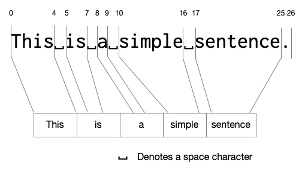
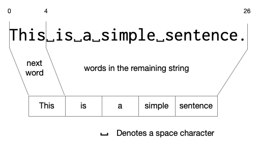

Parsing
=======

We represent many kinds of data as text -- i.e. as a sequence of characters.
Computing with such data therefore involves two processes --

1. Given the data, represent it as a sequence of characters. What ``display``
   does in Racket, for example.
2. Given a sequence of characters and information about what structure it
   has, produce the data that it corresponds to.

While we're familiar with the first, the second type of computation is
called "parsing" and is a very useful category of programs to examine.

List of words
-------------

Let's take a simple program that, when given a string (i.e. a sequence of
characters), produces a "list of words" in the order they're found in the
string. We have to define exactly what we mean in this problem first. To
start with, what is a "word"? Also importantly, what is "**not** a word"?

Some examples --

1. It is clear that in "This is a simple sentence", the "This", "is", "a",
   "simple" and "sentence" are all words we expect to collect. We might now
   surmise that words are separated by white space characters. So in both
   ``"hello    world"`` and ``"hello world"`` there are only the two words
   "hello" and "world".

2. How about ``"Roy said 'hello!' to Madhan."``? According to our rule above,
   we'll end up treating "Roy", "said", "'hello!'", "to" and "Madhan." as the
   "words" in the string. While "Roy", "said" and "to" seem alright, we perhaps
   want to treat "hello" and "Madhan" as the words and not "'hello!'" or
   "Madhan.". Maybe now we wish to change the rule to include both whitespace
   and punctuation characters to be ignored.

   .. note:: In every step we're trying to construct examples that might
      **not** conform to the rules we made up in the preceding steps. The idea
      is to have each step give us some information about our as yet unknown
      rule for "word", and checking a conformant example is not going to reveal
      any new information about our inner sense of what a "word" is.

3. Now we have to think of something that is neither an alphabetical letter
   nor a punctuation. How about an emoji? What should be the result for
   the string ``"Roy said 'hello😀' to Madhan."``? Should we treat ``hello😀``
   as one word? Perhaps not. So maybe we stick to "words are made of
   contiguous alphabetic characters".

4. So now we need to ask the question "are there any words that don't consist
   of contiguous alphabetic characters?". Sure enough, we have hyphenated words
   like "left-handed" or "two-thirds". If the string given has a Racket program
   in it, we might even have a sequence of characters like
   ``call-with-input-file`` where there are multiple hyphens in a contiguous
   sequence. Ok so do we permit hyphens in our words? 

   .. note:: This is a choice. The choice might be dependent on the circumstances
      under which we wish to employ such a word collector procedure. If we're
      looking to find all dictionary words, then we need to have a dictionary.
      If we're trying to understand the language of emojis, we might want to
      treat each emoji character as a word in its own right, or perhaps a sequence
      of emoji characters as a word as well.

   To keep things simple, we might just use the rule "contiguous sequence
   of alphabetical characters" and stick to whatever turns out.

   .. admonition:: **Task**

      Think about how making such a compromise can have ethical consequences
      when applied to a particular scenario. List them down. Don't worry about
      whether the consequence is significant or not for the moment.

5. So, are there any things we might not consider to be words but conform to
   the above rules? What about the string being a Java program instead and
   using an identifier like ``NetworkConnectionPool``? Is that one word or
   three words? What if the text contains "Person1, Person2, ..." and so on?
   Should we now include digits? Hmmm .. still, it's a choice on our hands.
   Maybe we want to treat the first case as three words, or maybe keep them
   together to capture the idea of an identifier. Maybe we don't want to
   include digits and just keep "Person". Maybe we aren't interested in 
   distinguishing between lower case and upper case letters? But then should
   "networkconnectionpool" be a single word we collect?

   So you can see that :hl:`thinking about the domain first and clarifying what
   we mean by each concept we need to model is the most important first step
   that determines the program we need to write`. To know that, we need to know
   for ourselves **why** we want to collect words in a string -- and what kind of 
   a string that is likely to be. This is why giving a sufficiently diverse set of
   examples is recommended in the `HtDP preface`_.

.. _HtDP preface: https://htdp.org/2026-5-28//Book/part_preface.html#(part._sec~3asystematic-design)

Since we're learning how to program here, let's start with keeping things
simple. We'll take a "word" to mean "longest contiguous sequences of alphabetic
characters" which fits most ordinary prose. By that, what we mean is that in
"hello", "el" is not a word and "hello" is the only word since it is the
"**longest** contiguous sequence".

Here is how we might break it down by adding just a little bit of
detail at each step -

1. "List of words in given string" means "List of words between the start and
   end of the given string".
2. The start of the next word in the string is the first alphabetic character.
3. The end of the next word in the string is the first alphabetic character
   that has a non-alphabetic character after it, or is the last alphabetic
   character in the string.
4. Once we extract the next word according to (2) and (3), we can change the
   starting position to the character after the end of the word we just extracted
   and repeat the process until we reach the end of the string.

   .. note:: This is an interesting development. Knowing that our words don't
      overlap within the string means that consecutive words can only occur with
      an intervening non-alphabetic character (including white space). So we've
      essentially broken down the problem of "find list of words between two
      positions" into "find the next word" and then "find the list of words after
      the end of the next word until the end position". The latter is basically
      the same thing we set out to solve, only now it is a **smaller** problem
      since the string is decidedly shorter this time.

Let's collect some concept phrases from that description and clarify what they mean --

1. "Word" - we've dealt with this already.
2. "list of words" - Hmm we don't know how to do lists yet! Mark it up on our TODO list ;)
3. "start position" - the index of the first character in the string that needs to be examined.
4. "end position" - the index of the last character in the string that needs to be examined.
5. "next word" - the first word that occurs at the head of the string from the given
   start position.

Our "TODO list" has one item in it - "Find out how to work with lists!". We'll take
a little detour to sort that out.

Lists in Racket
---------------

Lists in Racket are constructed using the ``list`` word like ``(list 'one 2 'three 4 "five")``.
This list has 5 elements in it, two symbols, two numbers and one string.

Given a list, we can find the number of elements in it using ``length``, like this --

.. code:: racket

   > (length (list 'one 2 'three 4 "five"))
   5
   > (define one-to-ten
       (list 'one 'two 'three 'four 'five 'six 'seven 'eight 'nine 'ten))
   > one-to-ten
   '(one two three four five six seven eight nine ten)
   > (length one-to-ten)
   10

Remember that we said in an earlier section that in the interaction window
Racket will try to print out values in such a way that if you copy and paste
the printed out result back in, you'll get the same result.

That suggests to us that ``'(one two three ...)`` might be another way to construct
the same list? Let's try that out --

.. code:: racket

   > (define one-to-ten '(one two three four five six seven eight nine ten))
   > one-to-ten
   '(one two three four five six seven eight nine ten)
   > (length one-to-ten)
   10

We can get the first item from a given list using ``first`` and the index ``k`` 
element from a list using ``list-ref``.

.. code:: racket

   > (first one-to-ten)
   'one
   > (list-ref one-to-ten 3)
   'four
   > (list-ref one-to-ten 0)
   'one
   > (list-ref one-to-ten 10)
   ❌ list-ref: index too large for list
   index: 10
   in: '(one two three four five six seven eight nine ten)

An interesting thing about a list is that if we move the opening parenthesis
in ``(one two three ...)`` one term to the right, we get another list
``(two three ...)``. This is called "the rest of the list" and can be gotten
using the word ``rest``.

.. code:: racket

   > (rest one-to-ten)
   '(two three four five six seven eight nine ten)
   > (length (rest one-to-ten))
   9
   > (list-ref (rest one-to-ten) 2)
   'four
   > (list-ref (rest (rest one-to-ten)) 1)
   'four
   > (list-ref (rest (rest (rest one-to-ten))) 0)
   'four
   > (first (rest (rest (rest one-to-ten))))
   'four
   > (rest '(one two))
   '(two)
   > (rest (rest '(one two)))
   '()

What ``list-ref`` really does is to keep taking "the rest of the list" while
also decrementing the index until it reaches index ``0`` at which point it just
uses the ``first``. We also see that once we reach the end of a list, we get an
**empty list** notated as ``'()``. The ``empty`` word also stands for this
empty list.

Ok we can take the ``first`` and ``rest``, but if we have a list and an item,
can we construct a new list whose "first" will be the given item and whose
"rest" will be the given list? This is what the word ``cons`` does.

.. code:: racket

   > (define zero-to-ten (cons 'zero one-to-ten))
   > zero-to-ten
   '(zero one two three four five six seven eight nine ten)
   > (length zero-to-ten)
   11
   > (first zero-to-ten)
   'zero
   > (rest zero-to-ten)
   '(one two three four five six seven eight nine ten)
   > (cons 'one empty)
   '(one)
   > (cons 'one (cons 'two empty))
   '(one two)

.. hint:: To remember ``cons``, you can think of it as short for "construct a
   list by prepending an item to a given list".

Mapping the problem
-------------------

So now that we know about how to build up and take apart lists, we can use this
to think about "list of words". 

   How we'd like to map the "words" we find in a simple sentence
   to elements of a list.

The below figure shows how we wish to think of the problem.

   Collecting words is about finding the next word, and collecting
   the remaining words.

As long as at each stage we're only dealing with a shorter string, we're
guaranteed to reach the end of the string at which point we can declare
that we're done.

Let's start at the top and work out details on the way down.

.. code:: racket

   (define (list-of-words text)
      (must-be-a-string "list-of-words:text" text)
      (define start-pos 0)
      (define end-pos (string-length text))
      (list-of-words-between text start-pos end-pos))

   (define (list-of-words-between text start-pos end-pos)
      ...TBD...)

We can choose that if the ``start-pos`` is at or beyond the ``end-pos``,
then the list of words ought to be an empty list. This gets us --

.. code:: racket

   (define (list-of-words-between text start-pos end-pos)
      (if (>= start-pos end-pos)
         empty
         ...TBD...))

Now, to find the "next word", we need to first find the start of the
next word. At that point, we know that the character at the start of
the next word will be alphabetic, or if there are no words remaining,
the index will be at or beyond the end. Then we find the first point
at which characters cease to be alphabetic and mark that as the end
of the "next word".

.. code:: racket

   (define (start-of-next-word text start-pos end-pos)
      (if (>= start-pos end-pos)
         end-pos
         (if (char-alphabetic? (string-ref text start-pos))
             start-pos
             (start-of-next-word text (+ 1 start-pos) end-pos))))

   (define (end-of-next-word text in-word-pos end-pos)
      (if (>= in-word-pos end-pos)
         end-pos
         (if (char-alphabetic? (string-ref text in-word-pos))
             (end-of-next-word text (+ 1 in-word-pos) end-pos)
             in-word-pos)))

We want to check if these are doing ok.

.. code:: racket

   > (start-of-next-word "hello" 0 5)
   0
   > (start-of-next-word "54321go" 0 7)
   5
   > (end-of-next-word "54321go" 5 7)
   7
   > (start-of-next-word "go now." 6 7)
   7
   > (start-of-next-word "???" 0 3)
   3
   > (end-of-next-word "go now." 0 7)
   2
   > (end-of-next-word "go now." 3 7)
   6

With these two, we can now handle picking the next word.

.. code:: racket

   (define (list-of-words-between text start-pos end-pos)
      (if (>= start-pos end-pos)
          empty
          (let ([wstart (start-of-next-word text start-pos end-pos)])
            (if (>= wstart end-pos)
                empty ; No more next words available.
                (let ([wend (end-of-next-word text wstart end-pos)])
                  ; Found the next word.
                  (define next-word (substring text wstart wend))
                  ; The remainder of the string is from wend to end-pos.
                  (cons next-word (list-of-words-between text wend end-pos)))))))

Putting it all together, we have --

.. code-block:: racket
   :linenos:
   :caption: Collecting the list of words from a given string.

   (define (list-of-words-between text start-pos end-pos)
     (if (>= start-pos end-pos)
         empty
         (let ([wstart (start-of-next-word text start-pos end-pos)])
           (if (>= wstart end-pos)
               empty ; No more next words available.
               (let ([wend (end-of-next-word text wstart end-pos)])
                 ; Found the next word.
                 (define next-word (substring text wstart wend))
                 ; The remainder of the string is from wend to end-pos.
                 (cons next-word (list-of-words-between text wend end-pos)))))))

   (define (start-of-next-word text start-pos end-pos)
     (if (>= start-pos end-pos)
        end-pos
        (if (char-alphabetic? (string-ref text start-pos))
            start-pos ; The first alphabet is the start of the word.
            (start-of-next-word text (+ 1 start-pos) end-pos))))

   (define (end-of-next-word text in-word-pos end-pos)
      (if (>= in-word-pos end-pos)
         end-pos
         (if (char-alphabetic? (string-ref text in-word-pos))
             (end-of-next-word text (+ 1 in-word-pos) end-pos)
             in-word-pos))) ; The first non-alphabet is the end of the word.

 
.. admonition:: **Lessons**

   We first broke down the problem and defined the domain terminology
   carefully before writing a single line of code. 

   Then we started at the top level and freely used the defined domain
   terminology to represent intermediate concepts that are needed to the
   express the solution (as in ``list-of-words-between``).

   We then defined the terminology used in the code one by one. We used the
   values needed as arguments to guide us on how each successively defined
   procedure must work.

   We'll call this approach "IPD", short for "Incremental Program Development".
   This approach to writing out the code works only **after** you've figured
   out how to solve the problem. It works through a process of verbalizing
   the intended solution starting from the top-level and working your way
   down adding detail in each step.

How do we know it works?
------------------------

Every procedure definition is made with some assumptions about the contexts
in which it will be used, usually, by another programmer. To clarify to
this programmer that we do know that the procedure works "as advertised",
we need to also tell them how we can make that claim.

One common approach is to give a collection of tests that we can demonstrate
the procedure to pass. Such "unit tests" are a commonly used approach to make
statements about the functionality of procedures, and also to provide examples
of using the procedure in various proper and improper ways.

To express such tests, we can use the words introduced by the ``rackunit``
package. After saving the word extractor procedure definition into a 
``words.rkt`` file, create a ``words-test.rkt`` file with the following
contents.

.. code-block:: racket
   :name: words_test

    #lang racket/base

    (require rackunit "words.rkt")

    (check-equal? (list-of-words-between "hello world" 0 11)
                  (list "hello" "world")
                  "Simple case")

When we load this module in DrRacket and "Run" it, we see that there are no
errors reported. Are we done? There is an infinity of strings and positions we
can pass to ``list-of-words-between`` and how do we demonstrate that the
procedure will work in **all** those cases?

As you can can tell, this is a complex issue. However, programs are not written
willy nilly and the expected behaviour of a procedure can usually be bracketed
by a number of cases which clearly show what is expected to work and what is
expected to fail. If we use `Occam's razor`_ and choose these cases wisely, we
can have an effective (though necessarily incomplete) set of unit tests that
communicate the intent of the procedure well. 

.. _Occam's razor: https://en.wikipedia.org/wiki/Occam%27s_razor

Fortunately, we thought through a number of these issues right before we began.
So we can use those as test criteria, including some "edge cases" we haven't discussed.

.. code-block:: racket

   (check-equal? (list-of-words-between "" 0 0) empty)
   (check-equal? (list-of-words-between "123 456" 0 6) empty)

A string can be sized arbitrarily large. So technically we should test the
function on arbitrarily large strings to see if it continues to work. However,
for some such cases here, we can reason our way out. For example, as long as
we're able to construct a string of a particular size, we cal use a Racket
integer to represent its size and taking our function implementation makes no
assumptions about the string's size, we may take its size independence for
granted. Let's focus on the actual utility cases first.

.. code-block:: racket

    (check-equal? (list-of-words "hello world")
                  (list "hello" "world")
                  "Single spaced")

    (check-equal? (list-of-words "hello     world")
                  (list "hello" "world")
                  "Multiple spaces")

    (check-equal? (list-of-words "Roy said 'hello!' to Madhan.")
                  (list "Roy" "said" "hello" "to" "Madhan")
                  "Mixed words and punctuation.")

    (check-equal? (list-of-words "call-with-input-file")
                  (list "call" "with" "input" "file")
                  "Idenfier-like text")

.. admonition:: **Task**

   Complete the other known cases we've articulated at the start of this
   section. Include your own variations as well.

.. note:: Since we've articulated the cases to be considered **before** we
   wrote the function definitions, we could've articulated these tests before
   we even wrote the function in the first place. In general doing that is
   considered a good idea and is referred to as "test driven development"
   since as you implement the procedures, you use the tests at every stage
   to check what aspects of the functionality you're yet to cover. Thus the
   test is said to "drive" the development.

