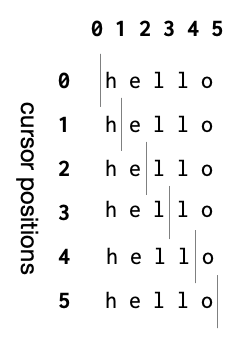

Strings
=======

A large number of programs written for general use involves working with
"strings" -- i.e. text manipulated as a sequence of characters in some
language/script. This is partly because programs do need to interface with
human operators, and partly because constructing mini languages to express
ideas and processes in programs can help human programmers make sense of what
is going on as well. 

.. tip:: You can think of a "string" as a metaphor for text by imagining a
   string on which beads with characters written on them are strung to make
   sentences. A "string" is a specific way to store and manipulate text.

For our purpose, strings offer a level of familiarity that can help us gain
ground with learning to read and write a few important kinds of programs.

As usual, make sure you have a DrRacket environment open as you work
through this section.

Getting feet wet
----------------

We've seen that we can type ``"Magnificent flying machines"`` into the
interaction window (or the definitions window) and Racket will understand that
the part of what you typed in between the two ``"`` (double quote) characters
are to be collected together in that sequence and kept as a single value. We
call such a specific sequence the **syntax** for representing **literal
strings**. After this value is stored in computer memory we say that the value
**has type string**.

Such strings can come from a variety of places --

- Given as literals within programs as shown just now,
- Read in from a text file stored on your computer,
- Read in from the sequence of response bytes sent by a server on the internet,
- Read in as the result of a database query,
- ... and so on.

Once a string has gained a place in computer memory as a value, we need a way
to refer to it. In Racket, and in many programming languages, is played by
an **identifier**. If "Magnificent flying machines" happened to be the title
of an article, we might bind the ``title`` identifier to the string value
by typing this into the "definitions window" and clicking on "Run" --

.. code:: racket

    (define title "Magnificent flying machines")

.. tip:: Ensure your definitions window's first like reads ``#lang racket`` which
   tells Racket that the rest of the contents use the "racket" language. Racket
   lets you define and develop your own languages within Racket, and so this
   starter line is an important clue for it to know how to read and interpret the
   rest of the contents.

The characters that make up the string are numbered starting from ``0`` and 
working your way upwards. So the first character ``M`` has the index ``0``,
the second character ``a`` has the index ``1`` and so on.

You can get the character at particular position in the string using the
``string-ref`` procedure like this --

.. code:: racket

    > (string-ref title 0)
    #\M
    > (string-ref "Magnificent flying machines" 8)
    #\e
    > (string-ref title 8)
    #\e
    > (string-ref title 11)
    #\space

.. hint:: In the above code block, we use lines that start with ">" to indicate
   things you have to type into the interaction window. The lines that don't
   start with ">" are the results that will be shown in the interaction window.
   To get the result, remember to press the <enter> key at the end. You do not
   need to type the leading ">" character.

To know the total characters in a string, you can use ``string-length`` like this --

.. code:: racket

   > (string-length title)
   27

The count of "27 characters" includes the two spaces between the words
in the ``title``.

.. admonition:: **Nuance**

   For our purpose, we'll stick to strings featuring ordinary roman letters,
   digits and punctuation and not the full suite of multi-lingual characters
   and emojis. If time permits, we'll get into that as it involves introducing
   a few more concepts that would be distracting for this course.

Now, what if the string we want to provide as a literal in the program itself
needs to use the double quote character? We'll need to somehow tell Racket how
to distinguish between a ``"`` that begins or ends a string literal, with a
``"`` that is supposed to be considered as part of the string. We have a little
syntax to help us with that. ``"`` characters that are intended to be a part of
the string will needed to be preceded by the ``\`` (backslash) character, as
shown below --

.. code:: racket

   (define name "Guy \"Schemer\" Steele")

If you include that in the definitions window, run and then type ``name`` into
the interactions window, you'll see that Racket prints out 

.. code:: racket

   "Guy \"Schemer\" Steele"

Exactly as we typed it. But this appears to not be what we wanted our string to be.
We certainly did not intend to have anything to do with the backslash character.
But it is only shown that way because :hl:`Racket tries to print out all of its results
as far as possible in a manner such that when you copy the output and paste it back
as input, you'll get the same result`. This is not possible in all circumstances, but it
is certainly possible here.

To see the actual string we created by typing that, run this --

.. code:: racket

    > (display name)
    Guy "Schemer" Steele

This will cause the string associated with the identifier ``name`` to be "displayed".
You'll see that the "\\" characters are not present in the output.

To further convince ourselves that the "\\" is purely syntax to help us tell
Racket which quote characters are part of the string, we can count the number
of characters we typed and measure the length of the string that resulted from
it. If we count the characters we typed in ``"Guy \"Scheme\" Steele"``
(excluding the opening and closing quotes), we get 22 characters. [#strexcl]_ But if you
then evaluate ``(string-length name)`` in the interaction window, we see that
the string length is reported as ``20``. The two backslash characters were only
seen while "parsing" and were discarded when constructing the string value.

.. tip:: The "\\" character is often read as "escape" because it tells Racket to
   "escape" from the mode of treating the next character as something special,
   and interpret it literally. In other situations, the opposite happens as
   well. For example, "n" is the ordinary lowercase letter, but when preceded
   with a backslash like ``\n``, it becomes "new line" which causes a new line
   of text to be started after that when the string gets displayed.

.. tip:: The word ``displayln`` can be used if you need to write out the
   string, but also end it with such a "new line" when it gets printed out in
   the interaction window or when you're running your program.

Hello there!
------------

We're now ready to write a very simple program and run it. 

.. code:: racket

   ; Purpose: Ask the user for their name and greet the user with the
   ; name they provided.
   (display "Please tell me your name: ")
   ; Read in a line of text given by the user and store it as a string
   ; value bound to an identifier.
   (define name (read-line))
   ; Construct the greeting by appending the name to a standard greeting.
   (define greeting (string-append "Hello " name "!"))
   ; Show the greeting
   (display greeting)

A number of things to observe here.

- We have lines that begin with ';' characters that DrRacket seems to show
  in a different way. Racket treats all characters from a ';' up to the end
  of that line as a "comment" and ignores these characters. So, as far
  as Racket goes, the above program is literally equivalent to --

  .. code:: racket
    
     (display "Please tell me your name: ")
     (define name (read-line))
     (define greeting (string-append "Hello " name "!"))
     (display greeting)

  These comment lines are useful to someone reading your program to understand
  your intentions. While we've been verbose here, such in-program comments are
  usually written assuming the reader knows the syntax and basic vocabulary of
  the programming language.

- Place the cursor on the ``read-line`` word and go through its documentation
  as discussed in the :doc:`interrogation` section. You'll see the usage
  described as ``(read-line [in mode]) → (or/c string? eof-object?)`` in this
  case. The part within ``[]`` is optional, meaning you can omit those
  arguments and ``read-line`` will behave in some documented way when used
  without those arguments. You might also guess that the result of
  ``(read-line)`` can be either a string or something called an "eof object".
  If you click on the ``eof-object?`` hyperlink in the documentation, it'll
  take you to its description which reads "A value (distinct from all other
  values) that represents an end-of-file.".

  In our case, there is no "file" whose end we need to consider. So we can
  ignore that case and only think of the result as being a string, as indicated
  by the ``string?`` possibility.

- Similarly, go to the documentation for ``string-append`` and you'll see
  ``(string-append str ...) → string?``. The "..." means you can provide
  one or more strings and there is no real limit being placed on how many
  you can provide for "appending". You can also see that the result will,
  in all cases, be a string.

  In our code, we've used three arguments for ``string-append``.

- Our baby program is constructed in a classic three-part structure --

    1. Read some input data.
    2. Perform some computation on the data.
    3. Output the result of the computation.

  This structure is very common for a vast number of programs and a useful way
  to split a compound task. Thinking of it this way lets you separate the "how
  to get input" and the "how to present the result" part from the "how to
  compute" part. This helps make your program be more flexible to permit reuse
  of the "how to compute" part when the means of input/output change.

Abstract ``greeting``
---------------------

After running the program, if you type ``greeting`` into the interaction window,
you'll see that it is a string type value that contains the name you gave. We
can then choose to abstract the idea of a greeting as containing an arbitrary
name decided at the point the abstraction is used.

.. code:: racket

   ; Purpose: Ask the user for their name and greet the user with the
   ; name they provided.
   (display "Please tell me your name: ")
   ; Read in a line of text given by the user and store it as a string
   ; value bound to an identifier.
   (define name (read-line))
   ; Construct the greeting by appending the name to a standard greeting.
   (define (greeting name) (string-append "Hello " name "!"))
   ; Show the greeting
   (display (greeting name))

Here, instead of defining ``greeting`` to be the appended string, we've 
defined it as a procedure that accepts a name and constructs the greeting
string. Then when we need to use this procedure, we supply the actual name
you provided to get the full greeting displayed.

.. _Task 1:

.. admonition:: **Task 1**

   Place your cursor on the ``name`` word in ``"Hello " name "!"``. You'll see
   that DrRacket draws an arrow from the ``name`` in ``(define (greeting name)
   ...)`` to this use of the identifier.

   Now place the cursor within the ``name`` word in ``(display (greeting name))``.
   You'll see DrRacket draws an arrow from the ``name`` in ``(define name (read-line))``
   to this usage.

   What do you think this means? Think about it a bit and try to come up with an
   answer before proceeding. Don't worry about being wrong.

Hope you've performed the task above?

Do you see the two *different* meanings of the word ``name`` in this small
program? This is a matter of what we called "scope" which determines meanings
of identifiers.

- The ``(define name (read-line))`` introduces a new identifier ``name`` within
  the scope of the whole program, and the last line ``(display (greeting name))``
  refers to this introduced definition.

- The ``(define (greeting name) ...)`` introduces a "local meaning" for the
  identifier ``name`` **within the context of its body**. This is also referred
  to as its "local scope" or "lexical scope" since the scope can be easily
  identified purely based on the textual context in which it occurs.
  This definition of the **concept of a greeting** can be used in more situations
  than the specific string constructed earlier.

      Abstractions are therefore the means to get re-usability of concepts.

- Since ``(define (greeting name) ...)`` introduces ``name`` within the scope
  of its body, there is now no way for the expressions within its body to refer
  to the identifier's meaning in the *enclosing* scope! Therefore we say the
  argument ``name`` of procedure ``greeting`` **shadows** the "outer ``name``.
  If you want to be able to access the outer ``name`` within the body of the
  ``greeting`` procedure, you'll have to use a different identifier for the
  argument.

Substrings
----------

``(substring str start end)`` can be used to extract a contiguous region of
characters from a given string. For example, 

.. code:: racket

   > (substring "Magnificent flying machines" 12 18)
   "flying"

.. _Task 2:

.. admonition:: **Task 2**

    Count the characters and understand how ``12`` identifies the start of the
    substring "flying" and ``18`` identifies its end. What do you think is the
    relationship between the length of the resultant string as reported by
    ``(string-length "flying")`` and the start and end positions we've supplied?

.. admonition:: **Task 3**

    Find out the start and end positions you need to give to extract the three
    words in ``"Magnificent flying machines"``. Also, experimentally find out
    the range of valid indices you can give for ``string-ref`` and
    ``substring`` for a given string.

.. admonition:: **Task 4**

    If you read the documentation of ``substring``, you'll see that it is
    presented as ``(substring str start [end])``. The ``[end]`` indicates that
    the argument indicating the end position is optional. Find out what you'll
    get when you omit the end position argument (``18`` in our example). Does
    this agree with your understanding of the documented behaviour? What happens
    if you give an end position value that indicates a position beyond the
    length of the given string? What happens if the "ending index" you give is
    before the starting index?

.. admonition:: **Task 5**

    Supposing the creator of the ``substring`` procedure decided to let you give
    ending index values beyond the end of the string, but will stop collecting
    characters when it reached the end of the string, what happens to the
    understanding of the relationship between the start and end indices and the
    length of the result string that you got earlier in `Task 2`_?

.. admonition:: **Learning**

    When faced with a new word you wish to use in your program, you can
    **interrogate** it for its meaning to determine whether the way you intend
    to use it. This gives you more confidence about using such a procedure than
    simply what its provided documentation might say, because you'll be testing
    it with the **specific** cases for which you intend to use it.

A "close reading"
-----------------

Suppose we have a string and an index into a valid position within the string.
For a string like ``"hello"``, there are the following positions as indicated
by the ``|`` character.

   The possible "cursor positions" in the 5-character string "hello".
   Note that 012345 make for **six** cursor positions in all.

Wait a minute! The string ``"hello"`` has only 5 characters and so only the
positions 0,1,2,3,4 should be valid. However now we're saying there are 6
positions 0,1,2,3,4,5?

If we try each of those positions with ``string-ref``, we'll read off the characters
one by one until we reach position ``5``, in which case ``string-ref`` will raise
an error.

.. admonition:: **Task**
      
   Do it and convince yourself that is the case.

However look at the series below --

.. code:: racket

   > (substring "hello" 0)
   "hello"
   > (substring "hello" 1)
   "ello"
   > (substring "hello" 2)
   "llo"
   > (substring "hello" 3)
   "lo"
   > (substring "hello" 4)
   "o"
   > (substring "hello" 5) ; This will give an empty (i.e. zero length) string.
   ""
   > (substring "hello" 6)
   substring: starting index is out of range
   starting index: 6
   valid range: [0, 5]
   string: "hello"

Notice that for ``substring``, we can go up to index ``5`` which yields the
empty string. So for substring, the index behaves as though we're asking for
all the characters after the cursor position whose index is given to ``substring``.

When we're being explicit with the ``end`` argument as well, we see --

.. code:: racket

   > (substring "hello" 2 4) ; from "he|llo" to "hell|o" gives "ll"
   "ll"
   > (substring "hello" 2 5) ; from "he|llo" to "hello|" gives "llo"
   "llo"

This consistent with our explanation of what the index means for the end position
as well.

To reconcile this view with ``string-ref``, we can now re-interpret the index
we pass to ``string-ref`` as though we're asking for the "character to the
right of the given cursor position". This ask does not make sense when the
index we give is greater than or equal to the number of characters, and truly
enough ``string-ref`` will produce an error if you do that.

Now armed with the "position of cursor" view of the index, we can see
that if we're given a string and an index, we can use this information to
represent two concepts -- a) the character to the right of the given cursor
position, and b) the substring consisting of all the characters to the right
of the given cursor position.

While our hand is forced when asked for a single character, we can always
produce an empty string if no characters meeting some criteria are available.

Remember this and we'll take it forward in the succeeding sections.

.. [#strexcl] Excluding the surrounding double-quote characters.

