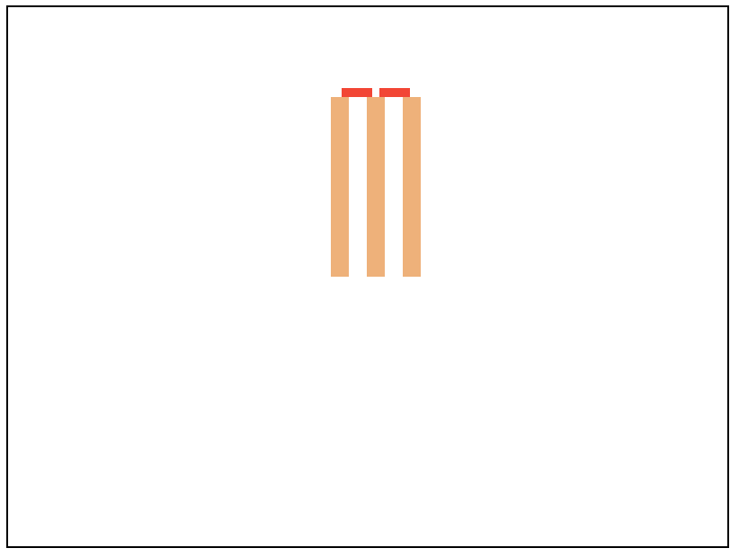

Interlude: SVG
==============

So far, we've been using Racket terms to express and work with ideas. In this
section we take an detour and look at SVG - Scalable Vector Graphics - a
"language" intended to make it easy to include and show drawn pictures and
animations in browsers. It is a large language, so we'll only be looking at a
small part of it relatable to what we've discussed regarding modelling images.

An example
----------

Copy the following code, paste it into a new file named ``example.svg`` and
open it in your browser.

.. _ex-svg:

.. code-block:: html
   :linenos:
   :caption: An example svg image.

   <svg width="400" height="300" xmlns="http://www.w3.org/2000/svg">
       <rect x="180" y="50" width="10" height="100" fill="sandybrown"/>
       <rect x="200" y="50" width="10" height="100" fill="sandybrown"/>
       <rect x="220" y="50" width="10" height="100" fill="sandybrown"/>
       <rect x="186" y="45" width="17" height="5" fill="red"/>
       <rect x="207" y="45" width="17" height="5" fill="red"/>
   </svg>

That should look like the picture shown below --

   
   The rendered image of the SVG shown in :numref:`ex-svg`.

What we've drawn is a bunch of rectangles, but when you see the image, you
might recognize the image as cricket stumps with bales. This is partly what
we've been labouring about as the distinction between represented information
and the "meaning" we attribute to it.

Now if we pay attention to the **form** of it, you might relate to how we
thought about images in Racket.

.. code:: racket

   (overlay (rect 180 50 10 100 'sandybrown)
            (rect 200 50 10 100 'sandybrown)
            (rect 220 50 10 100 'sandybrown)
            (rect 186 45 17 5 'red)
            (rect 207 45 17 5 'red))

The above might be an equivalent expression of the same construct using our
"image words". So we see that there is a kind of correspondence between
what we've notated as ``<rect x="220" y="50" width="10" height="100" fill="sandybrown"/>``
and ``(rect 220 50 10 100 'sandybrown)``. One might imagine we have defined
``rect`` something like --

.. code:: racket

   (define (rect x0 y0 width height colour)
      ...)

and the various parameters we're giving in ``(rect 220 50 10 100 'sandybrown)``
are attributed to the corresponding arguments.

We also see that the ``svg`` construct roughly parallels what ``(overlay ...)``
conveys, though with some additional information which we might've given
our ``render-image`` word.

We call such ``<svg>..</svg>`` **tags** which might have **child tags** within.
We call the ``width="200"`` and such values **attributes**. The entire "XML"
syntax [#syntax]_ is (almost) just that. Tags like line 4 of :numref:`ex-svg`
are shorthand for ``<rect x="220" y = "50" width="10" height="100"
fill="sandybrown"></rect>`` -- i.e. a tag which has no children.

.. note:: Thus "SVG" offers a notation and vocabulary to describe images by
   construction with similar principles of organization to how we've been
   thinking about images, even though we represented our images as functions
   from :math:`(x,y)` coordinates to colour.

SVG element kinds
-----------------

Much like our model of a constructed image, SVG provides basic vocabulary
to express simple geometric constructs like circle_, rect_, line_, ellipse_
which directly correspond to shown graphics. It also provides ways to
combine one or more such constructs into compounds, like g_ (short for "group")
which give means to transform_ what they contain in various ways.

.. _circle: https://developer.mozilla.org/en-US/docs/Web/SVG/Reference/Element/circle
.. _rect: https://developer.mozilla.org/en-US/docs/Web/SVG/Reference/Element/rect
.. _line: https://developer.mozilla.org/en-US/docs/Web/SVG/Reference/Element/line
.. _ellipse: https://developer.mozilla.org/en-US/docs/Web/SVG/Reference/Element/ellipse
.. _g: https://developer.mozilla.org/en-US/docs/Web/SVG/Reference/Element/g
.. _transform: https://developer.mozilla.org/en-US/docs/Web/SVG/Reference/Attribute/transform

Much like our ``define`` word lets us introduce new identifiers that reference images
or image making words, SVG offers a defs_ tag that can introduce names for drawn elements
that can then be reused within the SVG image with use_.

.. _defs: https://developer.mozilla.org/en-US/docs/Web/SVG/Reference/Element/defs
.. _use: https://developer.mozilla.org/en-US/docs/Web/SVG/Reference/Element/use

.. admonition:: **Task**

   In our "stump and bales" image, each stump is pretty much the same except
   for appearing in two more "translated" positions. Similarly, the two bales
   are also identical exception for translation. Use ``<defs>`` (defs_) tag to
   define a ``#stump`` and ``#bale`` drawing and ``<use>`` (use_) it in the
   different positions so that the picture's SVG code does not have so much
   repetition in it. This is a minimal form of "abstraction" possible in SVG.

.. [#syntax] The word "syntax" refers to the form and structure with which some
   text appears.

