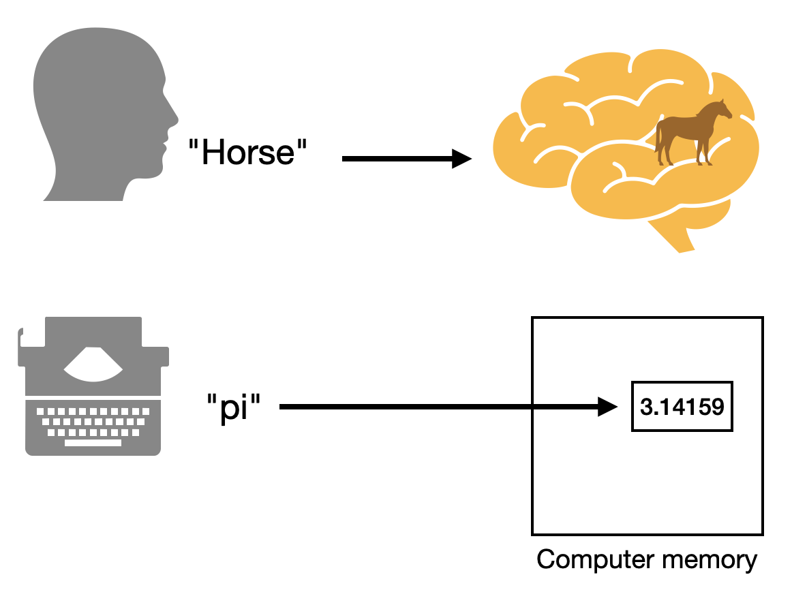

Words
=====

When we work with programs, we use a "language" and we'll need to understand
what we mean by a "language" in the context of computing, given that we're used
to using language for communicating with people.

All computer languages work with **words** and assign **meaning** to them which
might depend on the **context** in which the words occur. Understanding and
working with a program therefore means understanding what the words mean on
their own, and how groups of these words determine meaning. 

Some of these words and means of combination are defined for you and fixed by
the designer of a particular programming language. Some of them are defined for
you by authors of "libraries" -- which are collections of definitions for what
some new words mean. Much of the task of programming therefore is you the
programmer defining your own words and what they mean in relation to other
already defined words.

In his now famous talk `Growing a language <gal_>`_, Guy Steele takes us through 
the process of how a language is developed through definitions.

.. _gal: https://www.youtube.com/watch?v=_ahvzDzKdB0

.. admonition:: **Task**: Watch `Growing a language <gal_>`_

   Watch the talk and observe how Steele builds up his language starting with
   simple words and defining new ones he needs as he goes along. Though the
   talk doesn't require programming knowledge to follow, he is very much
   talking about the process of programming.

Identifiers
-----------

When I say "horse", you might conjure up an image of prototypical horse in your
mind's eye. The more visual of you might complete the scenery around the horse
as well. Similarly, when I say "steam engine", it invokes an image in your
mind. When I say "box car", you might not understand initially what I mean
(though you might), but would have some idea of what it might mean by putting
together your knowledge of a "box" and a "car" and might, for example, guess
that it might mean a "box on wheels". Now when I say "a horse in a box car
pulled by a steam engine", you can put together the individual pieces to form a
scene in your mind.

    
   The word "horse" invokes the image of a horse in our minds.
   This can be compared to how a word like "pi" in a program maps
   to a *value* stored in computer memory.

Much like that, words in an interactive programming language can refer to
"values" in computer memory, as illustrated in the figure above. 
DrRacket's "interaction window" lets you inspect the values associated with
various words it knows about already, by displaying a representation of the
value that the word refers to. [#analogy]_

We call such words in a programming language "identifiers" as they serve to
"identify" something in computer memory which we'll call the "value" of the
identifier. [#mem]_ We say the "identifier is bound to the value". In Racket,
you can use the ``define`` word to give meaning to (i.e. "bind") new words of
your own.

.. admonition:: **Exercise**:

   Start DrRacket and type the following into a new window.

   .. code:: racket

      (define scene "A horse in a box-car drawn by a steam engine.")

   Now click the "Run" button at the top right, type ``scene`` into the
   "interaction window" and press the "Enter" key. You should see the sentence
   printed out.

   What we've done here is to define the identifier ``scene`` to refer to
   the piece of text ``"A horse in a box-car drawn by a steam engine"``. When
   Racket sees a sequence of characters between double quotes, it will construct
   a "string value" and the ``define`` word will cause the ``scene`` word to be
   bound to the string value. Henceforth, you'll be able to use the ``scene``
   word to refer to that piece of text.
   
Common kinds of values
----------------------

All programming languages provide facilities to describe literal values
in programs, which will be read in from the program code and stored in
memory as a value. In the earlier section we saw how a "string" (short for
"string of characters") is written within double quotes ``"..."``. When Racket
sees that, it will recognize it and construct the string of characters as
a value in memory.

Racket also recognizes other kinds of things common with all programming
languages.

**Numbers**
   ``1``, ``42``, ``-23``, ``3.1415``, ``6.370e6`` and so on. These get stored
   as numeric values. The notation like ``6.370e6`` is called "scientific
   notation" and means the number :math:`6.370 \times 10^6`. 

**Strings**
   A sequence of characters (in any script/language) given within double quote
   characters -- ``"Horse drawn carriage"``, ``"Once upon a time ..."`` and so on.

**Characters**
   Individual characters are notated like ``#\a``, ``#\b``, ``#\c``, ``#\1``,
   ``#\2`` and so on.

**Truth values**
   ``#t`` stands for "true" and ``#f`` stands for "false". These can also be
   written in full as ``#true`` and ``#false`` respectively, though Racket
   will always display them as ``#t`` and ``#f`` so it is good to learn to
   recognize them.

**Symbols**
   Usually given prefixed with a single quote like ``'horse``. Such a "quoted
   symbol" stands for itself as the referrent value. If you type ``'horse`` in
   the interaction window, you'll get back ``'horse``. Not all programming
   languages provide symbols as values. A few which do are Racket (any "LiSP
   family" language), Julia and Prolog.

Phrases and sentences
---------------------

Earlier, we used the ``define`` word to introduce a new identifier ``scene``.
We had to type it in a special manner --

.. code:: racket

   (define <identifier> <value>)

There is an open parenthesis ``(`` followed by the word ``define``, which is
itself followed by the identifier to introduce, which is followed by the value
that the identifier must be bound to. We mark the end of the definition with a
closing parenthesis ``)``.

Here, ``define`` is a special kind of thing that we haven't introduced yet. It
does refer to a value, but a special kind of value which we'll get into later.

The more important aspect of this is the form ``(<operator> <operand1>
<operand2> ...)``. The  operator and the operands are all written
separated by one or more spaces, much like a sentence. The operator
gives meaning to the entire parenthetical construct. In the case where
the operator was ``define``, the ``(define ...)`` serves as the definition
of an identifier.

.. admonition:: **That's the key.**

   All Racket programs are built up of these kinds of "sentences" we'll
   call "symbolic expressions" or "s-expressions" for short. While
   Racket provides many pre-defined operators for us to use, we can also
   define our own operators and we'll see how shortly below.

The vocabulary of Racket
------------------------

... is **very** large! 

So large that no single person, not even Racket' creators, might know all of
it. There is a core vocabulary that comes with the ``#lang racket`` declaration
you've seen used at the start of your file(s). Even this is rather large, and a
large vocabulary makes for a large space of possibilities.

Fortunately for most of us, much of this vocabulary is structured in a manner
you can find out about the words you need when you need them by searching the
Racket documentation. Below are some commonly used "operator" words for your
reference -

**Math**
   - The usual operators ``+ - * / sqrt sin cos tan asin acos atan sinh cosh
     tanh asinh acosh atanh`` are all available. There are more mathematical
     operators ("functions") you can lookup in the documentation. Some example
     expressions using them are -- ``(+ 3 4)``, ``(* (sin 2) (cos 2))``, 
     ``(+ (* 3 3) (* 4 4))``.
   - There are also various comparison operators ``< <= > >= = !=`` and various
     ways to combine the truth values (also known as "boolean values") that
     they determine using ``(and b1 b2 ...)``, ``(or b1 b2 ...)``, ``(not
     bval)``.
   - Remember that all these operators are to be used using the same form
     ``(<operator> <operand1> <operand2> ...)``, with the number of operands
     varying between the operators.

**Strings**
   - ``(string-append s1 s2 ...)`` will concatenate all the given strings into
     one string. i.e. ``(string-append "hello" "+" "world")`` reduces to the
     string value ``"hello+world"``.

   - ``(string-ref <str> <0-based-index>)`` will get you the character at the
     given index. For ex: ``(string-ref "hello" 1)`` will get you the character
     value ``#\e``.

   - ``(string-length <str>)`` the number of characters in the given string.
     So ``(string-length "hello")`` will give you ``5``.

   - ``(substring <str> <start-index> <end-index>)`` picks a portion of the given
     string. For ex: ``(substring "hello world" 6 11)`` will pick out ``"world"``.

   - Strings can also be compared using ``string=?``, ``string<?``, ``string<=?``,
     ``string>?`` and ``string>=?``. Notice that the words that stand for
     "is this true or false?" use the convention that their names end with a question
     mark. So ``(string=? s1 s2)`` is asking "Is the string s1 the same as s2?" and
     therefore the name of the operator indicates that by ending with a question mark.
     So, yes, our "words" here are more than human language words.

   - Convert strings into upper and lower case using ``string-upcase``,
     ``string-downcase`` or ``string-titlecase``.

   - You can convert numbers to strings and vice versa using ``string->number``
     and ``number->string``.

**Symbols**
   - ``(symbol? val)`` asks whether the ``val`` is a symbol or not. So ``(symbol? 'hello)``
     will be ``#t`` whereas ``(symbol? 2.3)`` will be ``#f``.

   - You can convert symbols to strings and vice versa using ``string->symbol`` and
     ``symbol->string``. You might now notice that words that "convert" one kind of
     a value to another kind generally use the arrow notation in their names.

There are more of interest to us which we'll discuss soon.

Pictures as values
------------------

Type the following at the start of your Racket file --

.. code:: racket

   #lang racket
   (require 2htdp/image)

The ``require`` word when used as an operator fetches a collection of
definitions identified by the given "package identifier" and introduces
the words it defines for use within the rest of your program. We're now
borrowing all the definitions associated with working with pictures.

Click on "Run".

Now, all the words defined in the package named "2htdp/image" are available
for you to play with. For example, type the word ``circle`` into the interaction
window and press the <enter> key. You'll see ``<procedure:circle>`` displayed.
This means the ``circle`` identifier refers to a procedure and can therefore
be used in the operator position. Type the following into the interaction window --

.. code:: racket

   (circle 20 'solid 'blue)

You should see a solid blue circle show up. The ``20`` is the radius of the circle.
Try varying that for different values of the radius and colour.

Notice that we're using the ``'solid`` and ``'blue`` quoted symbols as
operands. So to read that sentence, it would say -- "Construct a circle of
radius 20 units, filled solid with the colour blue."

Now, what the interaction window shows you is a representation of the value and
much as you can copy and paste test, you can do the same with these pictures as
well. Let's find out the number of units this circle picture is. If we know our
geometry, we should expect it to be twice the radius, which is 40 units. So
copy the circle picture by selecting it first and hitting "ctrl-c" or "cmd-c"
(depending on your operating system). Then type ``(image-width`` and then a
space. Now paste the picture using "ctrl-v" or "cmd-v", then type ``)`` and
then press <enter>. 

You should see ``40`` displayed in the interaction window.

``image-width`` is a "procedure word" whose definition is provided in the ``2htdp/image``
package. It's purpose is to tell you the width of the image given as an operand.

Now, we constructed the circle picture using the ``(circle 20 'solid 'blue)`` expression
(or "sentence"). So it is natural to expect that ``(image-width (circle 20 'solid 'blue))``
will also give you ``40`` as the value. 

We're now seeing how such "phrases" and "sentences" can be combined to make
more complex values. In this case, our expression is now saying "the image
width of the circle of radius 20 painted solid blue".

Some picture words and how to use them in expressions -

- ``(circle <radius> <mode> <color-symbol>)`` makes a
  circle. Example ``(circle 20 'solid 'blue)`` or ``(circle 20 'outline 'green)``.
  Here ``<mode>`` is either ``'solid`` or ``'outline``.

- ``(rectangle <width> <height> <mode> <color>)`` - you can guess that this makes
  a rectangle.

- ``(overlay <image1> <image2>)`` - our first image combination which overlays 
  the first image on the second, making a new composite image.

- ``(empty-scene <width> <height>)`` makes an empty image of the given dimensions.
  You can now overlay stuff on top of this.

- ``(place-image <image> <at-x> <at-y> <background-image>)`` will place the given
  image at the given position (``at-x`` units from the left and ``at-y`` units from
  the top) on top of the given background image.

- ``(beside <image1> <image2> ...)`` makes a new image by placing the given
  images left to right.

- ``(above <image1> <image2> ...)`` makes a new image by placing the given
  images top to bottom.

.. admonition:: **Task**

   Using ``circle``, ``rectangle``, ``empty-scene`` and ``place-image``, draw
   a cricket pitch or a cricket bat/ball representation.

You can find more "image making and manipulating words" in the `2htdp/image
package`_ or go through how to use them in the `Image Guide`_.

.. _2htdp/image package: https://docs.racket-lang.org/teachpack/2htdpimage.html
.. _Image Guide: https://docs.racket-lang.org/teachpack/2htdpimage-guide.html

.. [#mem] The details of how such values are stored and referenced in computer
   memory are not of importance for the purpose of this course. If you're going
   to study computer science, you'll encounter courses that teach you about
   this aspect.

.. [#analogy] Understand that analogies are useful, but have their limitations. 
